# Conversational AI Design Patterns — Unified Catalog (2025–2026)

Synthesized from three independent research reports analyzing 13+ products (ChatGPT, Claude, Gemini, Cursor, GitHub Copilot, v0, Notion AI, Linear AI, Slack AI, Perplexity, Intercom Fin, Zendesk AI, Salesforce Einstein Copilot). This document catalogs the universal building blocks of conversational interfaces — the atoms, molecules, and organisms that define what a modern AI experience *is*.

**Sources:**

- Report A: "The Anatomy of Agentic Interfaces" (Gemini) — conceptual/editorial analysis, no citations
- Report B: "Comprehensive catalog of every UI component" (Perplexity) — cross-product research, 30 cited sources
- Report C: "The definitive catalog of conversational AI design patterns" — competitive analysis of 13 products, enterprise-focused

---

## Executive Summary

The trajectory from 2020 to 2026 follows three eras: **scripted bots** → **smart assistants** → **agentic co-workers**. The defining shift of 2025–2026 is that chat is no longer the destination — it's the control channel for a richer workspace where artifacts, tools, and actions live alongside dialogue.

**Key findings across all three reports:**

- ~80 distinct interaction patterns exist across modern AI products
- ~20 are table stakes — their absence feels broken
- The signature UI innovation of 2024–2025 is the **artifact/canvas split-pane**
- The meta-trend is a move from **Conversational UI** (asking questions) to **Delegative UI** (assigning goals)
- For enterprise platforms, **trustworthy action execution** with transparent reasoning, source attribution, human-in-the-loop approval, and reliable rollback is the critical frontier — more than conversational fluency

**For Arovy's context specifically:** The most successful AI interfaces in 2025 are deeply embedded in existing workflows, not bolted-on chatbots. Linear's ambient triage intelligence, Notion's dual-mode agent, and Salesforce Einstein's sidebar copilot all demonstrate this. An enterprise Salesforce-native platform should consider the **embedded copilot template** and **ambient intelligence** patterns as primary frames, with chat as a secondary surface.

---

## Part 1: Master Component Catalog

Legend — **Pri / Class** column:

**Priority** (Arovy build priority):
**MVP** = Must have for launch
- **V2** = Second iteration
- **V3** = Future / nice to have
- **S** = Skip — not applicable to Arovy
- **-** = Not yet decided

**Class** (industry classification):
- **TS** = Table stakes — expected in any serious 2025–2026 AI interface
- **D** = Differentiator — competitive advantage, not yet universal
- **CONTESTED** = Reports disagree on classification (see notes)

> **Decision points for Arovy** are marked with `[AROVY DECISION]` in the Notes column where the enterprise/Salesforce context may shift the classification.

---

### 1. Conversation Lifecycle

| Component | Description | Key Variants | Pri / Class | Best Example | Visual | Notes |
| --- | --- | --- | --- | --- | --- | --- |
| New chat entry point | Obvious affordance to start a fresh thread | Sidebar button, keyboard shortcut (⌘⇧O), "+" FAB, CTA on empty state | MVP / TS |  | [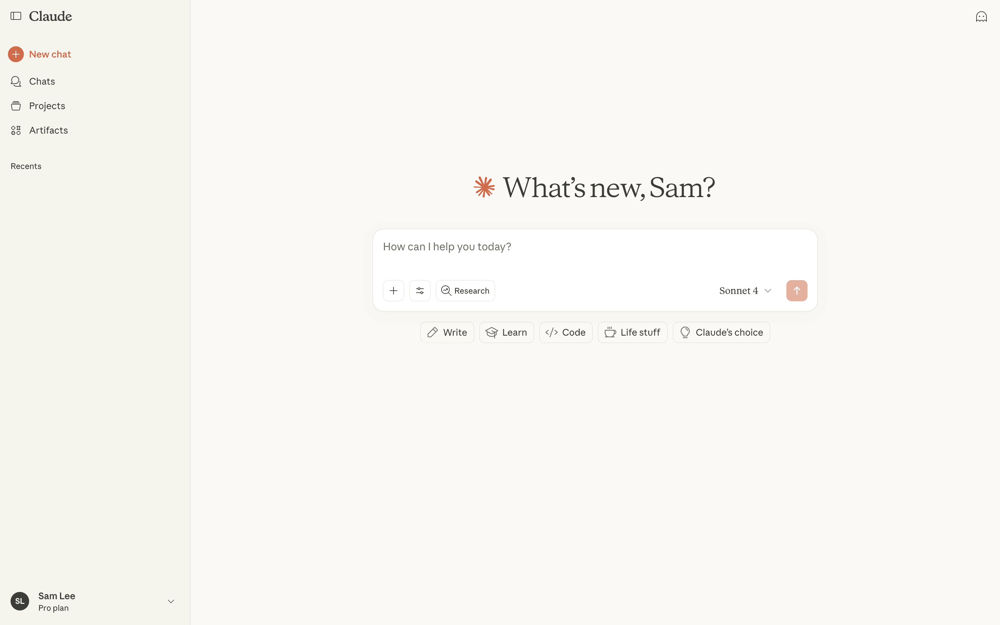](images/01-new-chat-entry-point.png) |  |
| Chat history | Persistent list of past conversations with auto-generated titles. Could be a button with a dropdown as well | Infinite-scroll, date-grouped, pinnable, folder-organized | V2 / TS |  |  [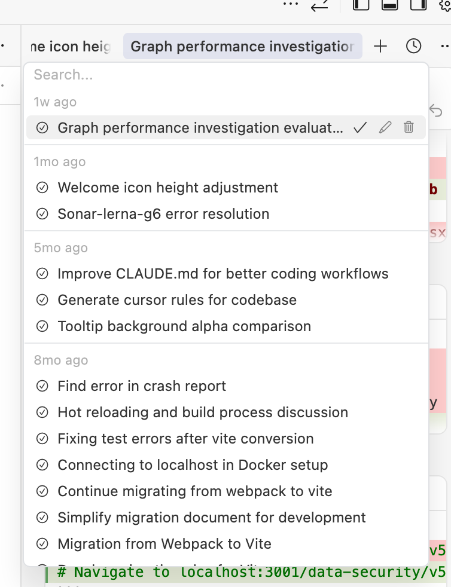](images/01-chat-history-button.png) |  |
| Auto/manual rename | Let users label threads for later retrieval | Auto-titles from first message, inline rename on hover, bulk rename | V2 / TS |  |  | Dependent on Chat History |
| Delete/archive chat | Remove or hide threads from history | Soft delete, archive, bulk multi-select, context menu | V2 / TS |  | [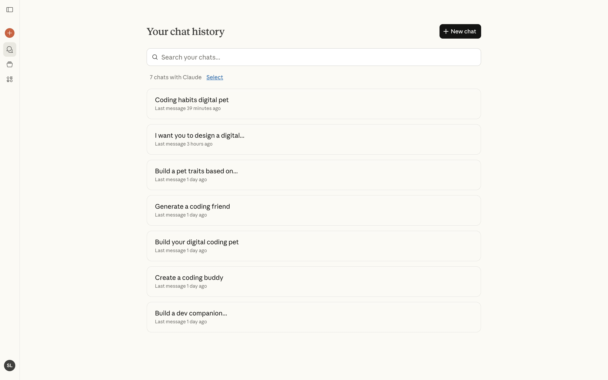](images/01-delete-archive-chat.png) |  |
| Search past conversations | Full-text or semantic search across all chat history | Keyword search, natural-language search, date/model/file filters | V2 / TS | Claude (natural language via tool call) |  |  |
| Pin/favorite chats | Elevate important threads for quick access | Pin to top, star/favorite toggle, favorites filter | V3 / D | Gemini | [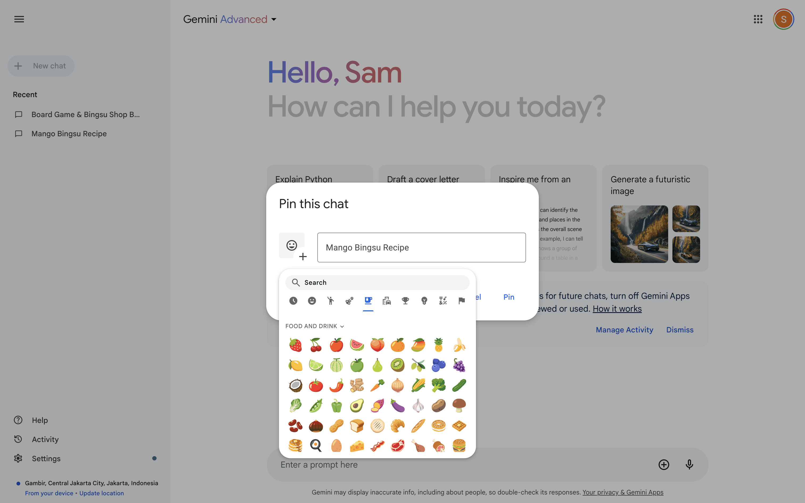](images/01-pin-favorite-chats.png) |  |
| Resume conversation | Re-open a prior thread with full context loaded | Click from history, "Continue in new chat" with link back | V2 / TS |  |  |  |
| Conversation branching | Edit a prior message to create an alternate response path | Edit-to-fork with sibling arrows (ChatGPT/Claude), "branch in new chat" copy (ChatGPT), duplicate chat (Cursor) | S / D |  |  | **Future-forward idea.** No major product has shipped real tree navigation — all store trees internally but expose them through a keyhole. ChatGPT removed edit-arrows ~Feb 2026; "Branch in new chat" is just context copy with no relationship tracking. Cursor has "Duplicate" not branching (their forum has open requests for actual tree nav). Only niche tools like Nodini.ai show a visual conversation graph. The concept is sound but implementations are universally limited — worth watching, not building yet. |
| Projects/workspaces | Persistent containers with custom instructions, knowledge base, scoped conversations | Claude Projects, Perplexity Spaces, Copilot Spaces | v3 / D | Claude Projects | [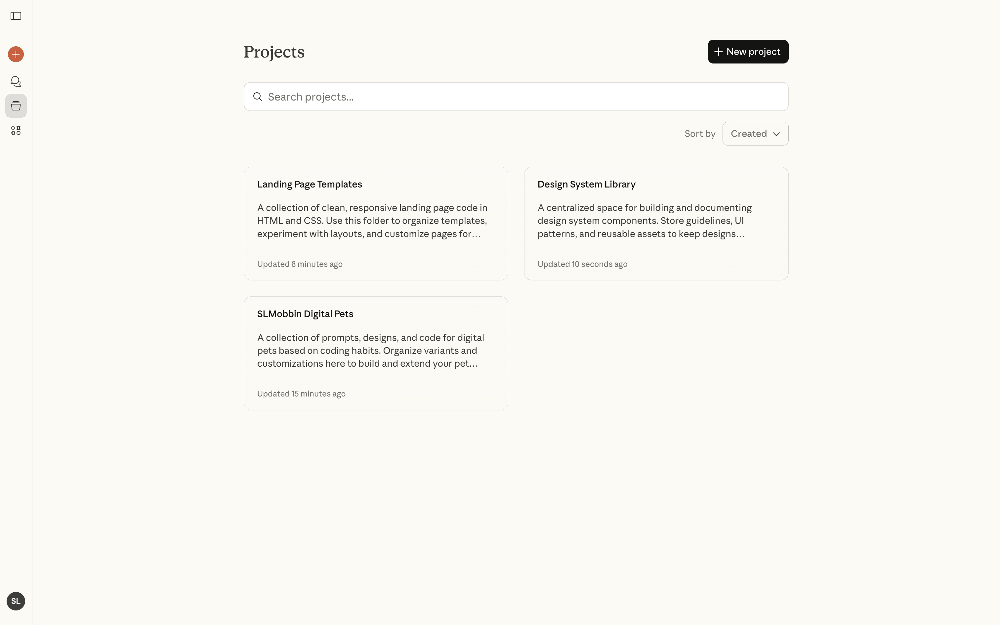](images/01-projects-workspaces.png) |  |
| Conversation templates/presets | Pre-configured prompt/persona/tool combinations | Custom GPTs, Gemini Gems, prompt files, v0 templates | S / D | ChatGPT (Custom GPTs store) | [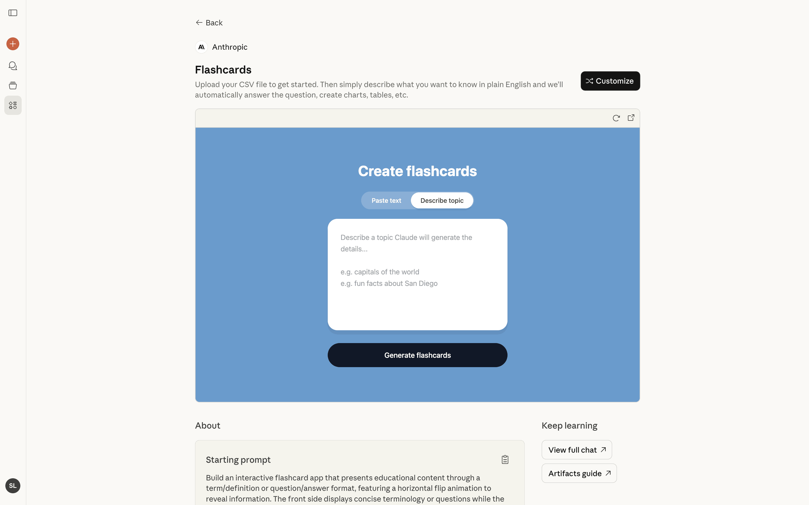](images/01-conversation-templates-presets.png) |  |
| Modes/agents | Switch between distinct AI behaviors within the same interface | ChatGPT modes (Canvas, Deep Research), Copilot modes (Ask, Edit, Agent, Plan), Cursor modes | v3 / D | Cursor | [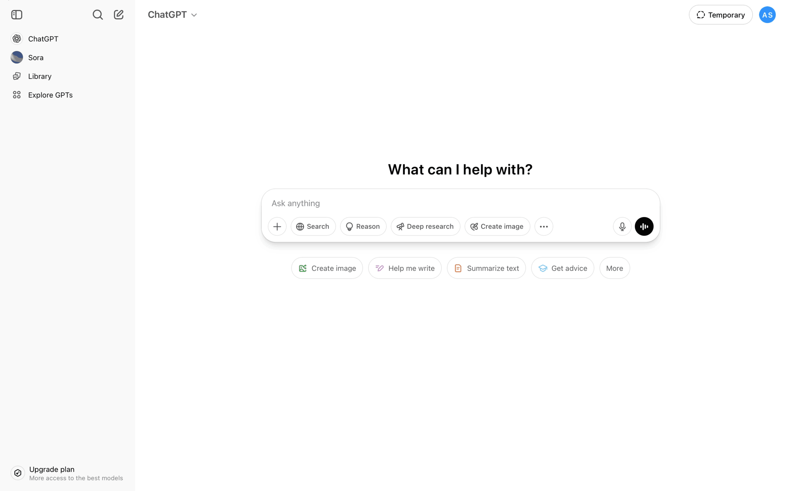](images/01-modes-agents.png) | Mode switching (e.g., "Audit mode" vs "Impact Analysis mode" vs "Documentation mode") could be a core Arovy pattern. |

---

### 2. Message Input

| Component | Description | Key Variants | TS/D | Best Example | Visual | Notes |
| --- | --- | --- | --- | --- | --- | --- |
| Auto-resizing text field | Multi-line input that grows as user types | Bottom-positioned, max-height with scroll, full-width or centered | MVP / TS |  |  |  |
| Input placeholder text | Ghost text in the empty input field that hints at capabilities and sets user expectations | Static hint ("Ask me anything..."), capability-hinting ("Ask a question, upload a file, or try /commands"), context-aware (changes based on current page/mode), rotating examples | MVP / TS | Claude ("How can I help you today?"), Cursor (mode-specific: "Ask anything" vs "Describe a change") | [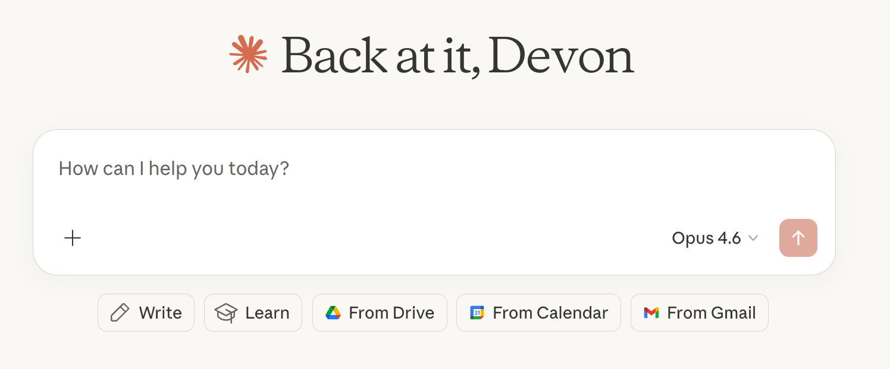](images/02-input-placeholder-text.png) | Subtle but high-impact — it's the first thing users read in every session. Sets the tone (friendly vs professional), signals supported input types (files, commands, mentions), and reduces blank-page anxiety. Context-aware placeholders like "Ask about this connected app..." or "Describe the change you want to analyze..." could guide users toward Arovy's core workflows without requiring onboarding. See also §5: Empty-state suggestion cards and Follow-up suggestion chips for related prompting patterns. |
| Send button | Triggers message submission | Arrow icon, appears only when input has content, disabled when empty | MVP / TS |  |  |  |
| Enter/Shift+Enter behavior | Enter sends; Shift+Enter adds newline | Configurable in some products; universal convention | MVP / TS |  | [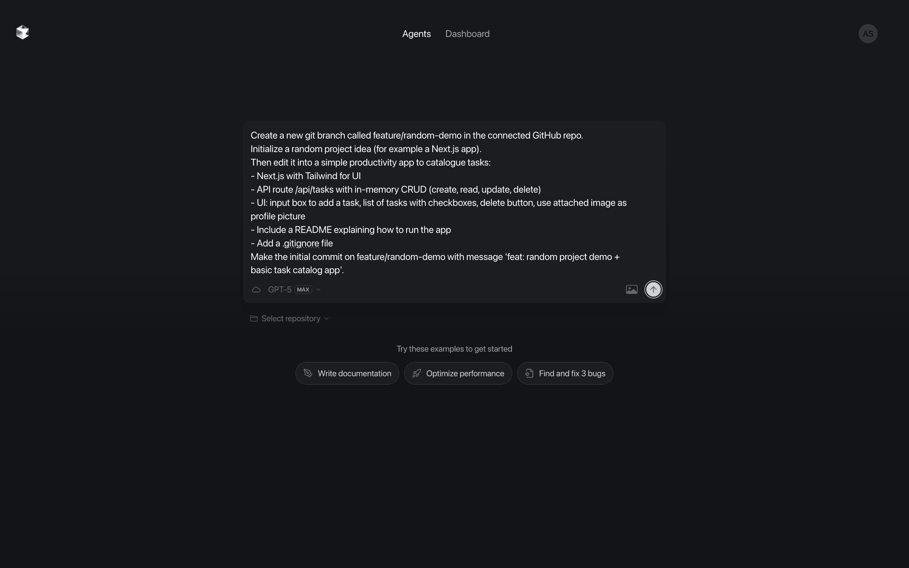](images/02-enter-shift-enter-behavior.png) |  |
| Voice input | Speech-to-text or conversational voice mode | Mic for transcription, full voice mode with real-time conversation, camera integration | S / D | ChatGPT (Advanced Voice Mode) |  |  |
| File & image input | Attach files, images, and screenshots as context via button, drag-and-drop, or paste | Paperclip/attachment button, OS drag-and-drop, clipboard paste, screenshot paste, cloud storage picker, camera capture (mobile) | V2 / TS |  | [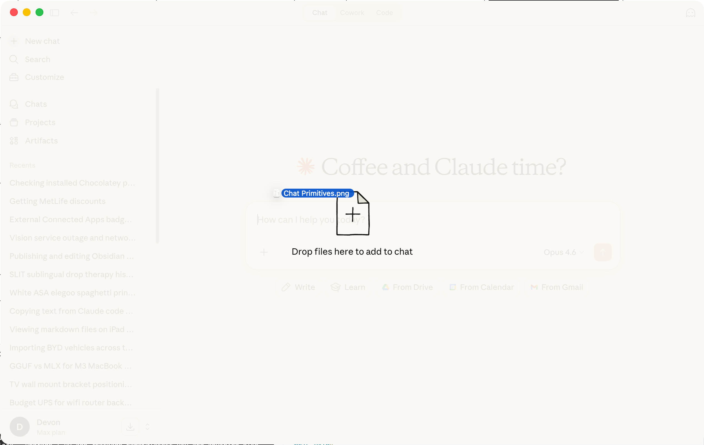](images/02-add_file.png) | Combines file upload, drag-and-drop, and image/screenshot input — all variations of "get stuff into the input." Need to be careful about context limits. Drag-and-drop is TS for desktop (B: "+", C: "TS"). Screenshot/image input is TS for the attach flow, D for advanced pipelines like v0's Figma → code. |
| @-mention context references | Reference specific files, people, tools, or data inline | @workspace/@file/@selection (Copilot), @filename/@Docs/@Web/@Git (Cursor), @PageName (Notion) | V2 / D | Cursor / GitHub Copilot (richest taxonomy) | [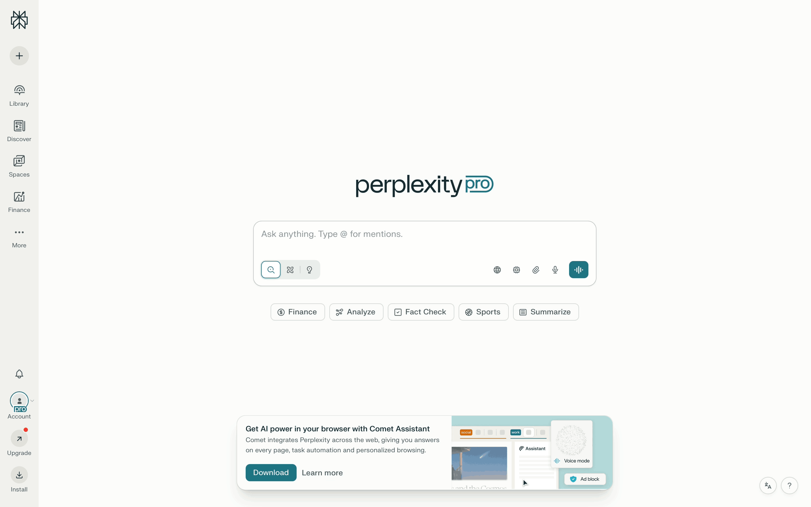](images/02-mention-context-references.png) [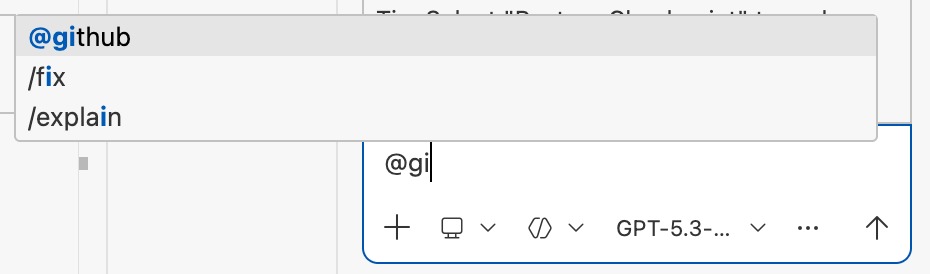](images/02-at-mention.png) | @-mentioning Salesforce objects, profiles, permission sets, or connected apps could be a killer feature. Think `@Fivetran` or `@Admin Profile`. |
| Slash commands | Trigger specific actions via "/" prefix | /fix, /tests, /explain, /search, /image, /canvas | V2 / D |  | [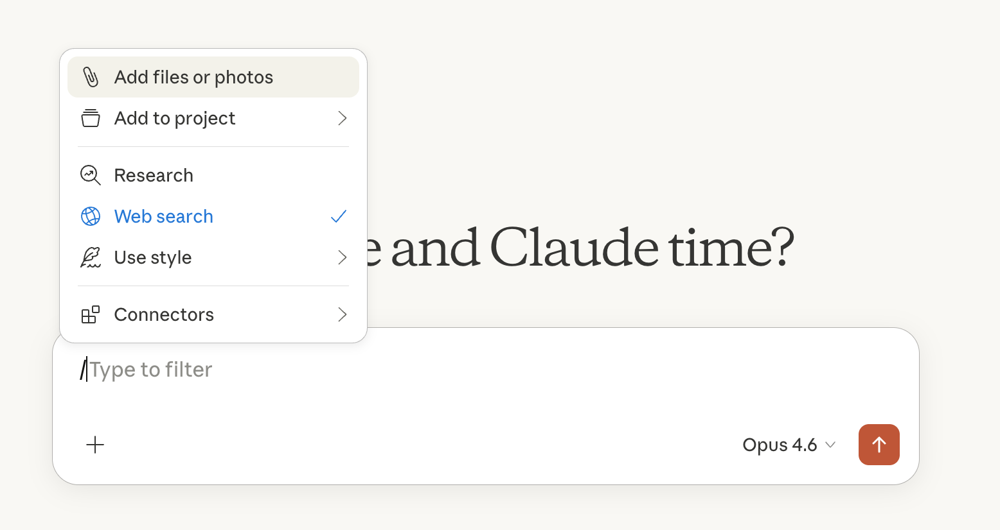](images/02-slash-commands.png) |  |
| Working set / context selector | Explicitly define which files or sources the AI should use | Copilot Working Set with "+" button, Notion "Specified context" picker, Perplexity Focus selector | V3 / D | GitHub Copilot (Edit mode Working Set) | [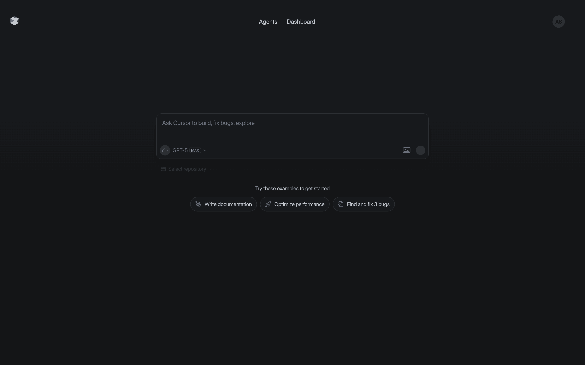](images/02-working-set-context-selector.png) | For Arovy, selecting which Salesforce org/environment/metadata subset is in context is could be useful |
| Model selector | Choose which AI model to use | Dropdown in header/input area, model name + capability badge, "Auto" mode.  New pattern of "Genius/Performance" vs Speed modes | S / D | ChatGPT (Auto/Fast/Thinking), Warp |  [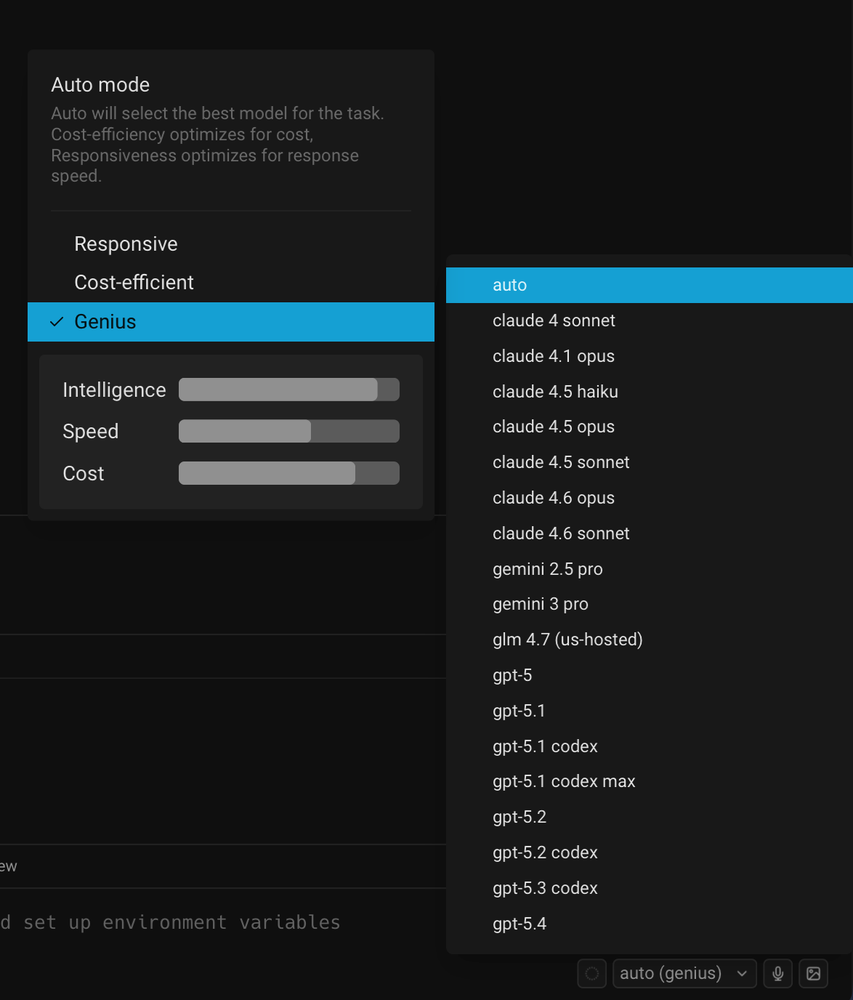](images/02-model-selector-genius-mode.png) |  |
| Input character/token indicator | Visual feedback on input length relative to limits | Warning when approaching limits; reactive warnings | MVP / D | None do this well yet | <!-- pending: 02-input-character-token-indicator.png --> |  |

---

### 3. Message Display & Rendering

| Component | Description | Key Variants | TS/D | Best Example | Visual | Notes |
| --- | --- | --- | --- | --- | --- | --- |
| User/assistant message bubbles | Visually distinct containers for each speaker | Right-aligned user + left-aligned AI; minimal backgrounds; avatar + name.  Moving towards block for user and AI just uses the whitespace | MVP / TS | Claude (most refined) |  |  |
| Markdown rendering | Rich text formatting in AI responses | Headers, bold, italic, lists, blockquotes, horizontal rules | MVP / TS |  |  |  |
| Code blocks with syntax highlighting | Formatted code with language detection and coloring | Language label, line numbers, dark theme code on light page | MVP / TS |  |  |  |
| Copy button on code blocks | One-click clipboard copy for code snippets | "Copy code" button in corner, "Copied!" confirmation | MVP / TS |  | [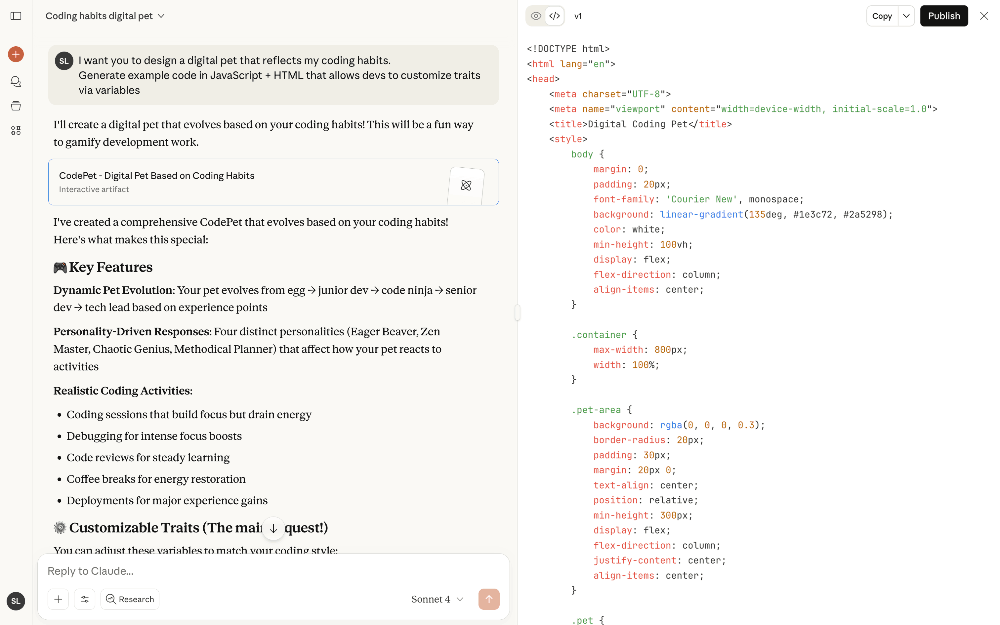](images/03-copy-button-on-code-blocks.png) |  |
| Code block action buttons | Actions beyond copy | Copy, Insert at Cursor, Insert into New File, Apply | S / D | Cursor (Apply button) |  |  |
| Tables | Rendered HTML/markdown tables in responses | Sortable columns, formatted headers, scrollable overflow | V2 / TS |  | [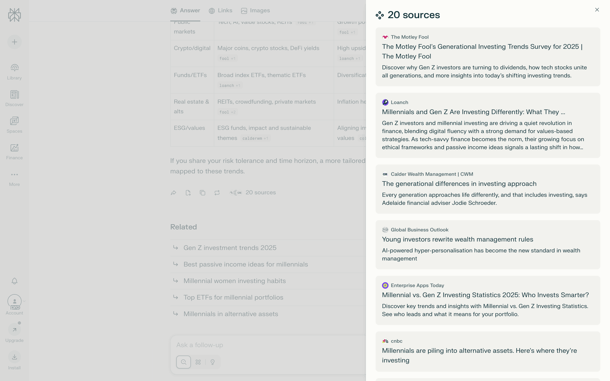](images/03-tables.png) | For Arovy's data-heavy output (permission matrices, field dependencies), interactive/sortable tables could be TS. |
| LaTeX/math rendering | Mathematical notation via KaTeX/MathJax | Inline and display math | S / D | ChatGPT, Claude | [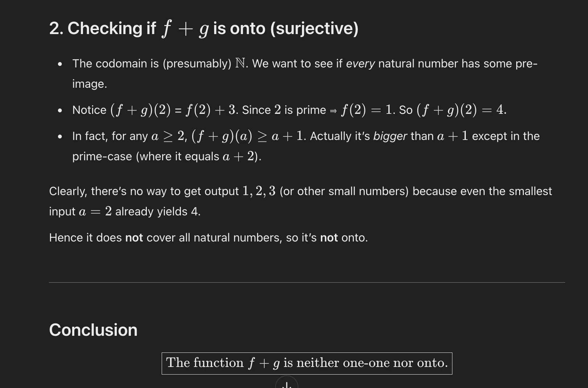](images/03-latex-math-rendering.jpeg) |  |
| Inline image display | Images rendered within conversation flow | Generated images, uploaded thumbnails, chart outputs | V2 / TS |  |  | For Arovy, this means dependency graphs, impact visualizations, org health dashboards rendered inline. |
| Inline citations | Numbered source references in response text | Superscript [1][2][3] with hover preview, clickable to source, source card panel, Mostly for Reports | S / D | Perplexity (gold standard) |  |  |
| Thinking/reasoning display | Visible chain-of-thought or reasoning process with progressive disclosure | Expandable thinking with timer (Claude), collapsible summary (ChatGPT), research stages (Gemini), collapsible tool results, "Used references" collapse | S / D | Claude (most transparent — expandable thinking with elapsed timer) | [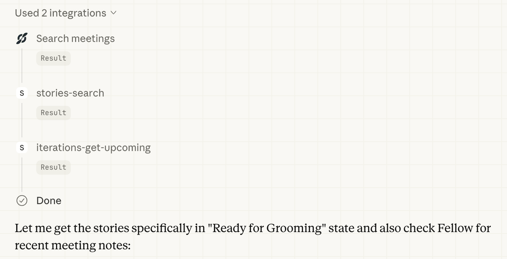](images/03-collapsible-expandable-sections.png) |  |
| Artifact/canvas panel | Side-by-side editable output surface | Claude Artifacts (live React), ChatGPT Canvas, Gemini Canvas, v0 preview pane | v3 / D | Claude Artifacts, v0 (three-pane) |  | Could be an emerging pane for "ephemeral UI" |
| Diff display | Color-coded additions/deletions for changes | Red deletions + green additions, unified diff, multi-file aggregated | V2 / D | Cursor (multi-file diff viewer) |  |  |
| Draft variants | Multiple response alternatives to choose from | "View other drafts" showing 2-3 alternatives | S / D | Gemini | [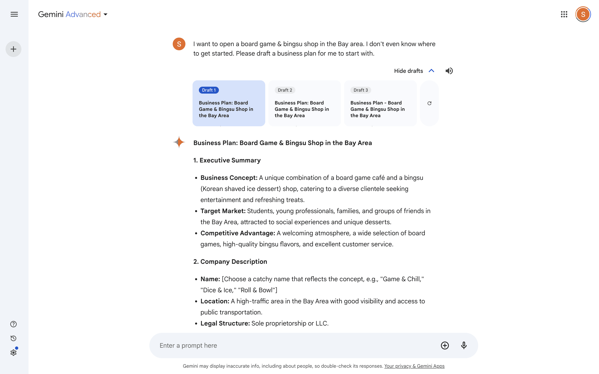](images/03-draft-variants.png) | This is mostly for the company's benefit to allow users to give direct feedback on which version they like better |
| AI-generated label/badge | Transparent indicator that content is AI-generated | "AI-generated" badge, watermark on images | NA / TS | Microsoft Copilot | <!-- pending: 03-ai-generated-label-badge.png --> | Arovy already uses AI badges for documentation — this is TS for enterprise. |

---

### 4. Streaming & Generation

| Component | Description | Key Variants | TS/D | Best Example | Visual | Notes |
| --- | --- | --- | --- | --- | --- | --- |
| Token-by-token streaming | Text appears progressively as generated | Word-level streaming with auto-scroll, shimmer effect on input | MVP / TS |  |  |  |
| Typing/thinking indicator | Visual feedback that AI is processing or actively generating | Blinking cursor/caret at generation point, pulsing dot/line colored by agent state, bouncing dots, "AI is thinking..." text, skeleton shimmer | MVP / TS |  | [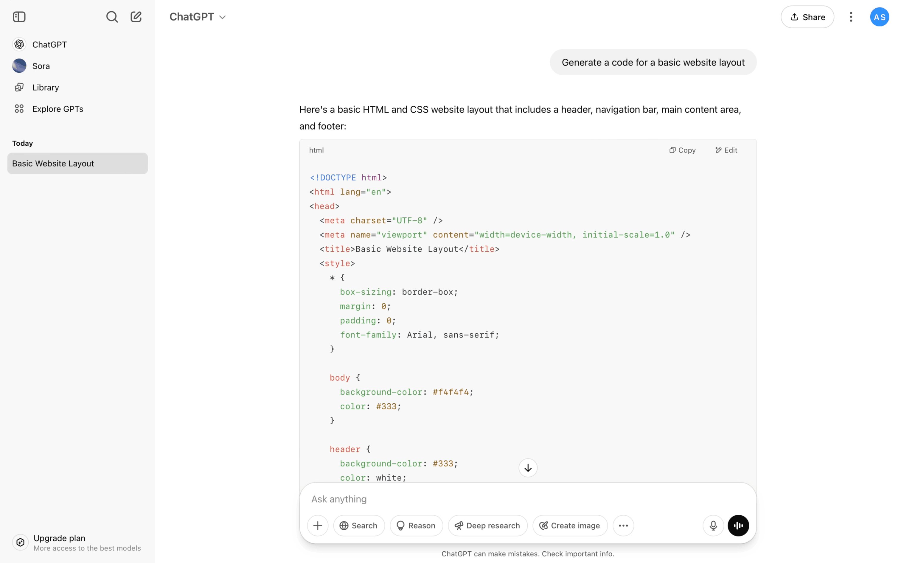](images/04-blinking-cursor-caret.png) | Combines pre-generation waiting state (bouncing dots) and active generation state (blinking cursor). |
| Stop generation button | Cancel in-progress response | Square stop icon replacing send button, ⌘+Backspace, Esc key | MVP / TS |  | [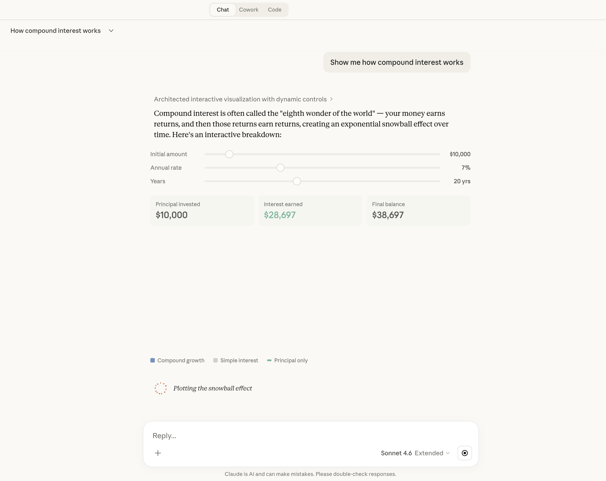](images/04-stop-generation-skeleton-shimmer.png) |  |
| Skeleton/shimmer loaders | Placeholder UI while results are prepared | Shimmering text blocks, placeholder cards, wireframe shapes | MVP / TS |  |  |  |
| Multi-step progress indicator | Transparent stages for long operations | Research plan → source analysis → synthesis → report; "Searching..." → "Analyzing..." → "Writing..." | S / D | Gemini Deep Research (live research plan with modifiable steps) | [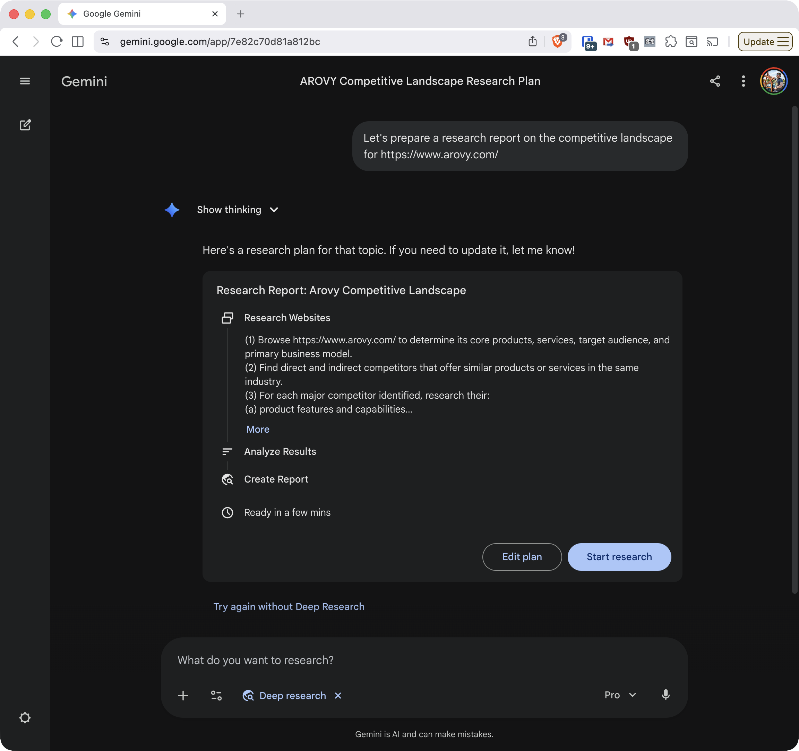](images/04-multi-step-progress-indicator.png) |  |
| Estimated time indicator | Duration feedback for long operations | Claude Extended Thinking timer, "up to 10 minutes" notice | V2 / D | Claude (real-time elapsed timer) | <!-- pending: 04-estimated-time-indicator.png --> |  |
| Real-time preview updates | Live-updating preview pane during code generation | v0 preview renders as code streams, Cursor applies diffs in real-time | S / D | v0 | <!-- pending: 04-real-time-preview-updates.png --> |  |

---

### 5. Suggestions & Prompting

| Component | Description | Key Variants | Pri / Class | Best Example | Visual | Notes |
| --- | --- | --- | --- | --- | --- | --- |
| Empty-state suggestion cards / pills | Clickable prompts shown when no conversation exists | 3-4 cards with sample tasks, periodically refreshed, category-organized | MVP / TS |  | [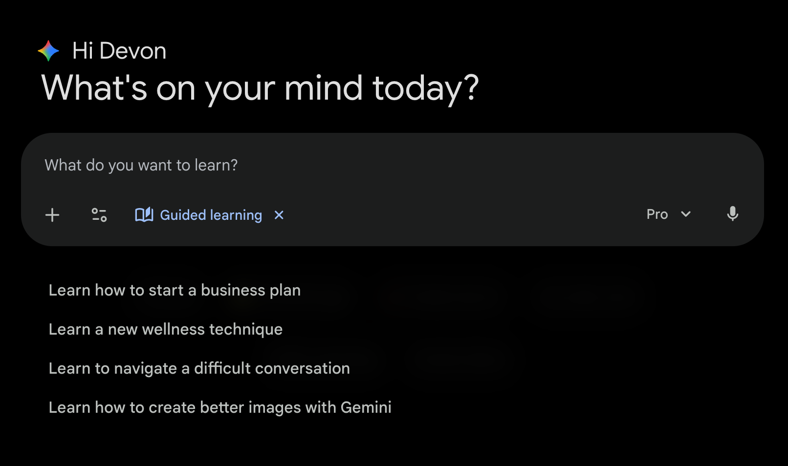](images/05-empty-state-suggestion-cards.png) |  |
| Follow-up suggestion chips | AI-generated next-question buttons after each response | Horizontal chip row below response, 2-4 contextual suggestions | MVP / TS |  | [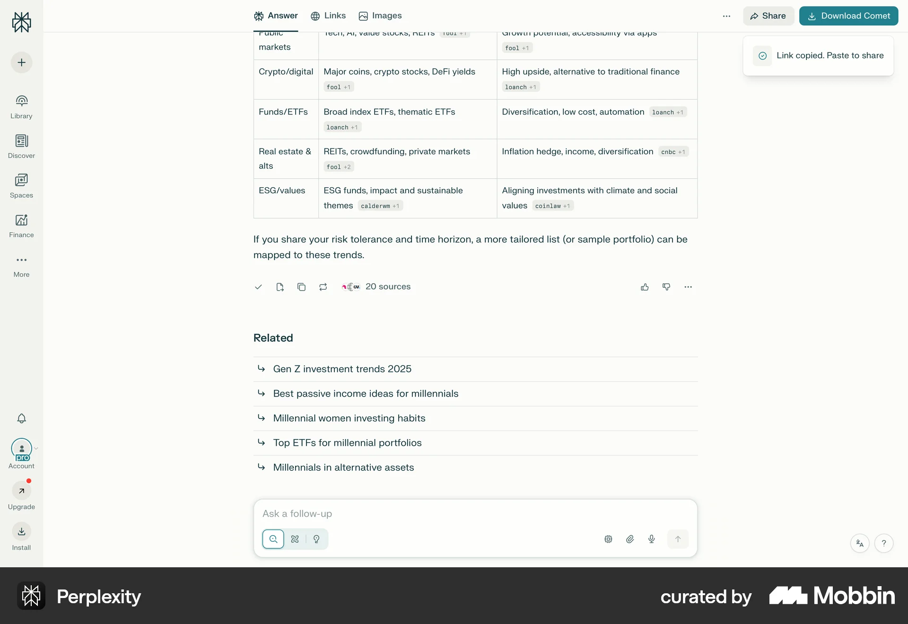](images/05-follow-up-suggestion-chips.png) |  |
| Command palette | Searchable index of all available AI commands and tools | ⌘K searchable action index, keyboard shortcuts, category-grouped commands | S / D | Linear (⌘K command palette) | [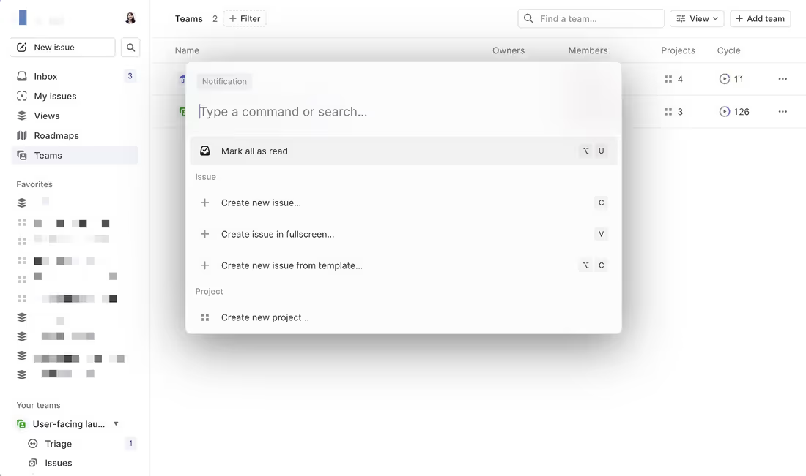](images/05-command-palette.png) |  |
| Prompt library/templates | Curated collection of reusable prompts | Custom GPTs store, prompt files in repo, team-shared templates | S / D | ChatGPT (GPT Store ecosystem) | [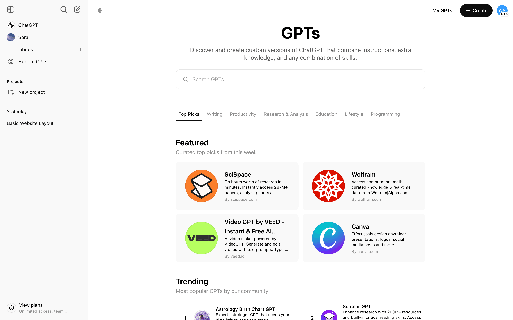](images/05-prompt-library-templates.png) |  |
| Contextual quick actions | Context-sensitive AI actions based on current state | Space bar on empty line (Notion), sparkle icon (Copilot), suggested macros with confidence (Zendesk) | S / D | Notion AI | [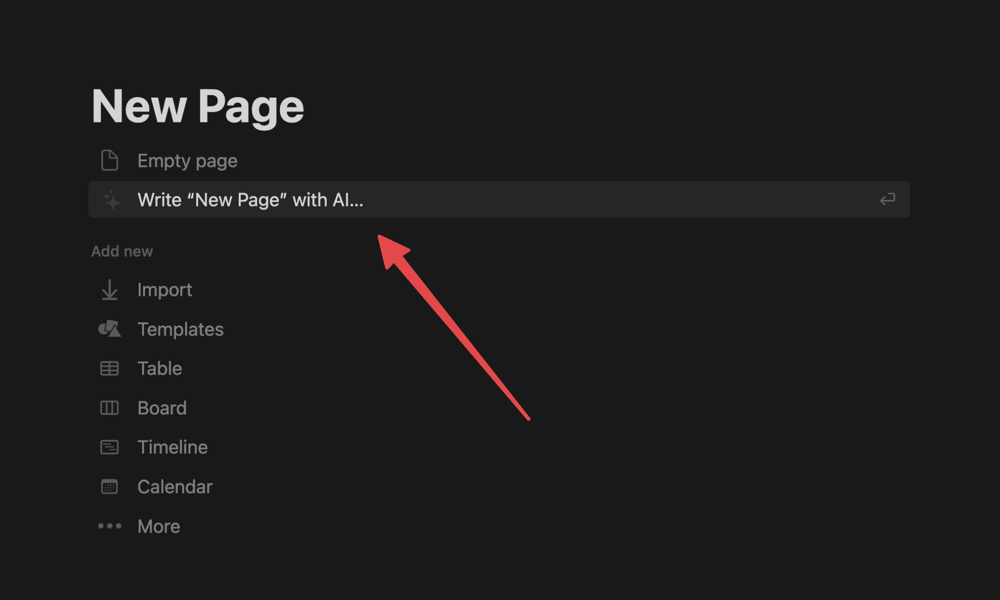](images/05-contextual-quick-actions.png) |  |
| Autocomplete/typeahead | Ghost text suggesting completion as user types | Inline ghost text (like Gmail Smart Compose), dropdown suggestion list | S / D | IDE assistants (Copilot) | [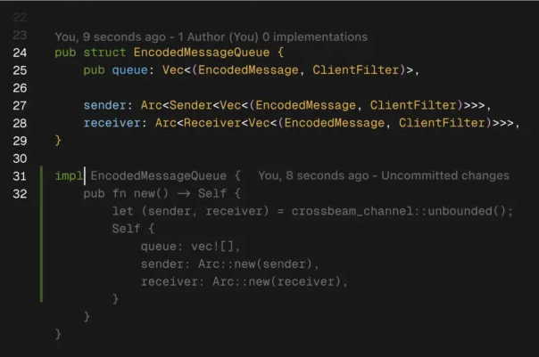](images/05-autocomplete-typeahead.png) |  |
| Clarifying questions | AI asks for more information before answering | Perplexity Pro Search guided refinement, Intercom Fin contextual follow-ups | V3 / D | Perplexity |  |  |

---

### 6. Feedback & Iteration

| Component | Description | Key Variants | Pri / Class | Best Example | Visual | Notes |
| --- | --- | --- | --- | --- | --- | --- |
| Thumbs up/down | Binary quality rating per response | Icon buttons below response; thumbs-down may prompt text feedback | MVP / TS |  | [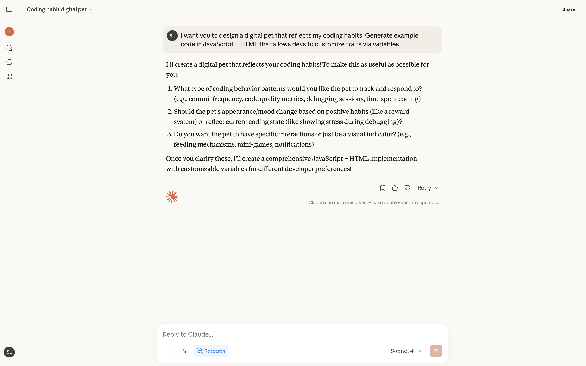](images/06-thumbs-up-down.png) |  |
| Regenerate response | Generate new response to same prompt | "Regenerate" button or icon, may produce alternate approaches | MVP / TS |  |  |  |
| Edit and resubmit | Modify a previous user message and re-run | Pencil icon on user messages; creates branch (ChatGPT) or overwrites (others) | MVP / TS | ChatGPT (creates navigable branch) |  |  |
| Copy full response | Clipboard copy of entire AI response | Copy icon in response action bar, separate from code-block copy | MVP / TS |  |  |  |
| Share conversation | Generate shareable link to conversation | Public link, privacy toggle, team-only sharing | V3 / T |  |  |  |
| Export conversation | Download in structured format | Google Docs export (Gemini), Markdown/JSON, PDF | S / D | Gemini (one-click Docs export) | [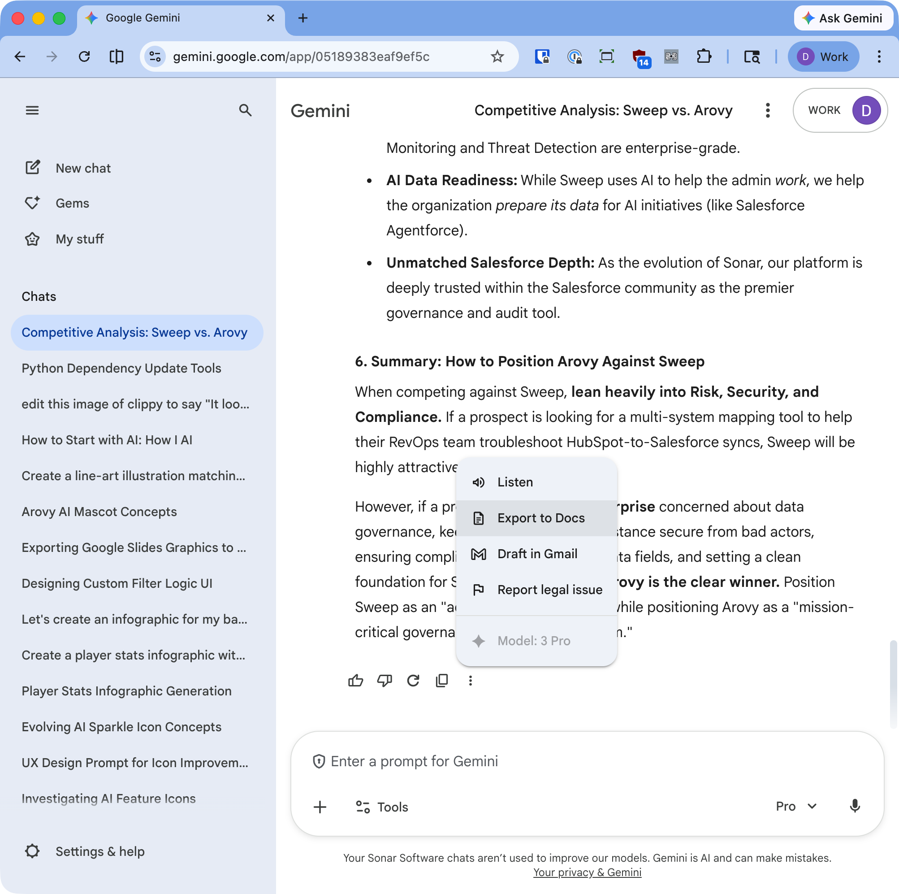](images/06-export-conversation.png) |  |
| Report/flag response | Safety/abuse reporting per message | Flag icon, "report unsafe/incorrect" dialog | S / TS |  | [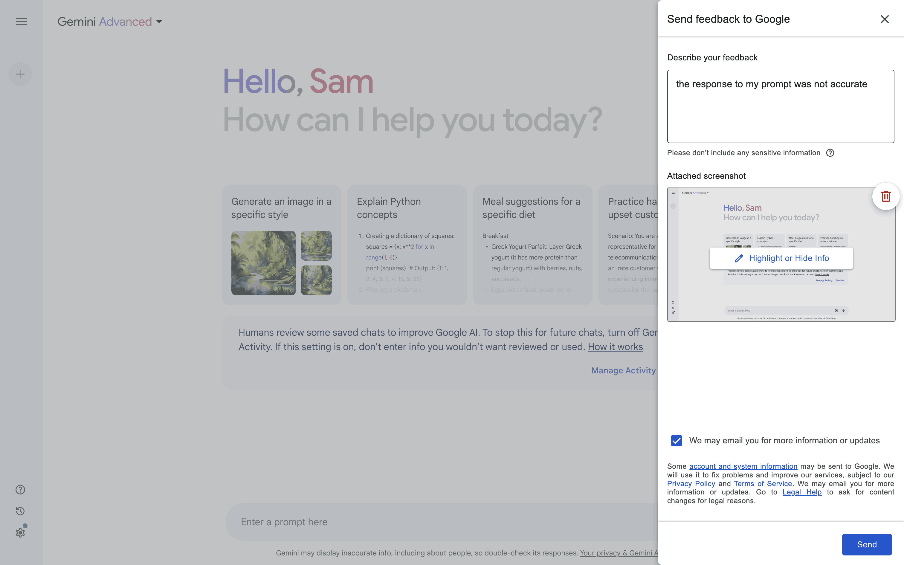](images/06-report-flag-response.png) |  |
| Inline refinement ("Magic Highlight") | Highlight specific text section to request change only to that portion | Select text → floating tooltip → type instruction → section regenerates in place | S / D | ChatGPT Canvas, Notion AI | [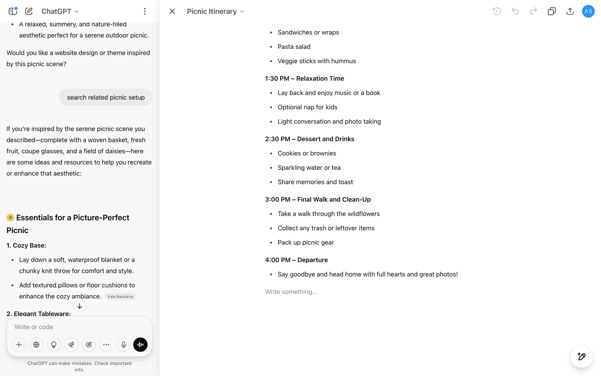](images/06-inline-refinement-magic-highlight.png) |  |
| Accept/reject changes | Approve or dismiss AI-proposed modifications | Tab to accept, Esc to reject (Cursor), per-file or bulk, "Accept"/"Discard" (Notion) | v3 / D | Cursor (granular per-change with checkpoint rollback) | [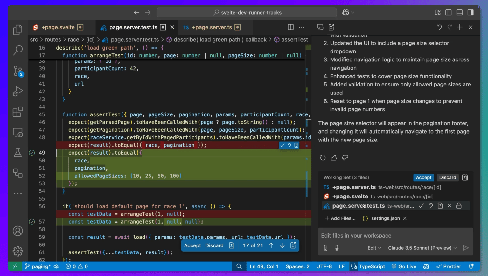](images/06-accept-reject-changes.png) | Not essential for the chatbot usecase, but if we start making changes from the chatbot it will be. |
| Inline iteration controls | Refine output without full regeneration | "Make longer," "Make shorter," "Change tone," "Simplify" | S / D | Notion AI (richest inline refinement menu) |  |  |
| Detailed rating/survey | Structured feedback beyond thumbs | Star rating, multi-choice reasons, free text | - / D | Slack AI | [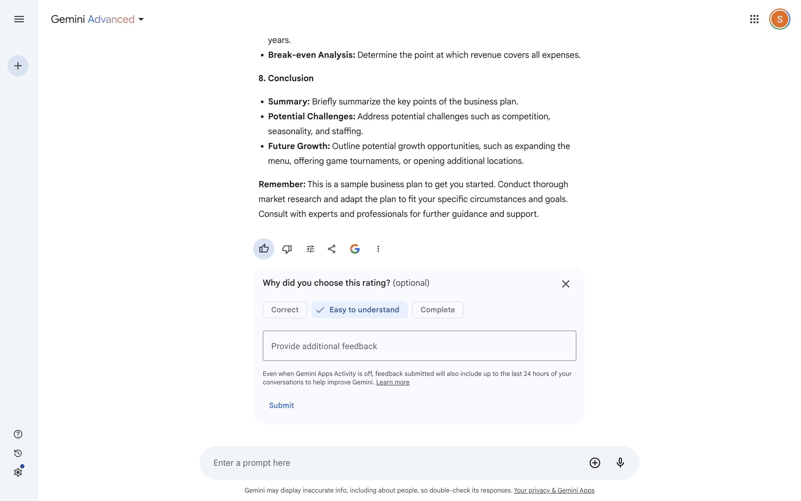](images/06-detailed-rating-survey.png) |  |

---

### 7. Context & Awareness

| Component | Description | Key Variants | Pri / Class | Best Example | Visual | Notes |
| --- | --- | --- | --- | --- | --- | --- |
| Page/screen context binding | Use current page/screen as default context.  Variation of "@" mentioning context. | "Ask AI about this page," automatic context binding | MVP / TS | Notion Agent, Claude in Chrome | [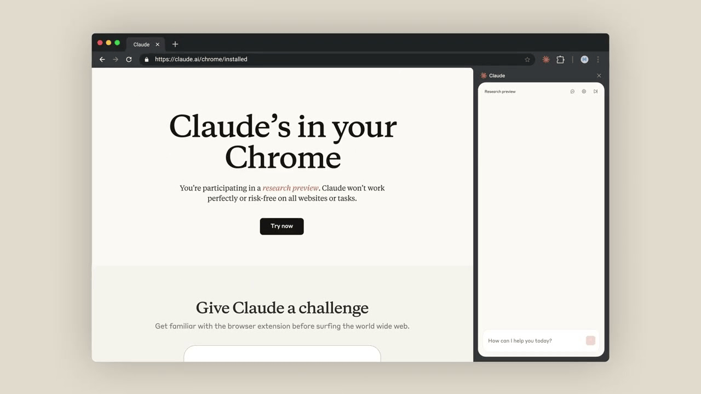](images/07-page-screen-context-binding.png) |  |
| Selected text/element context | Use highlighted selection as input | Highlight → "Ask AI" contextual menu, selected code as context | V3 / D |  | <!-- pending: 07-selected-text-element-context.png --> |  |
| File/document context | AI reads and reasons over uploaded or referenced documents | Per-chat uploads, project knowledge bases, workspace-wide indexing, codebase indexing | MVP / TS | Notion AI (workspace-wide + 12 connected app integrations) | [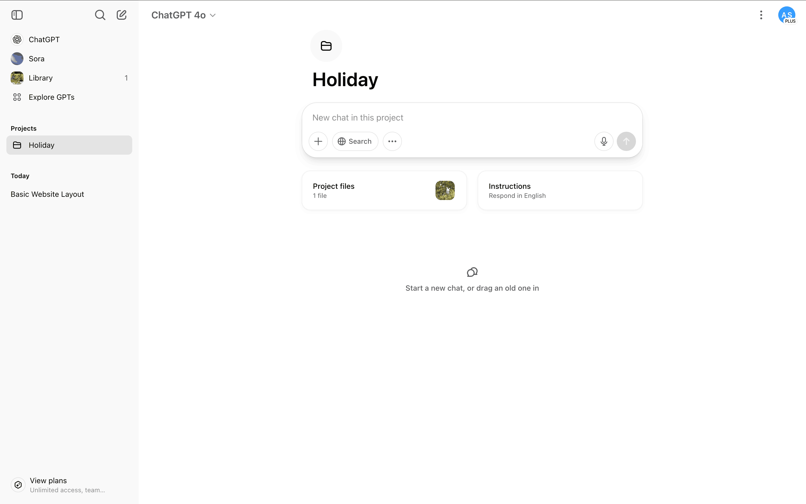](images/07-file-document-context.png) |  |
| Cross-session memory | AI remembers user information across conversations | Proactive + profile-building (ChatGPT), opt-in/user-controlled/project-scoped (Claude), Google data personalization (Gemini) | MVP / D | Claude (most privacy-conscious) | [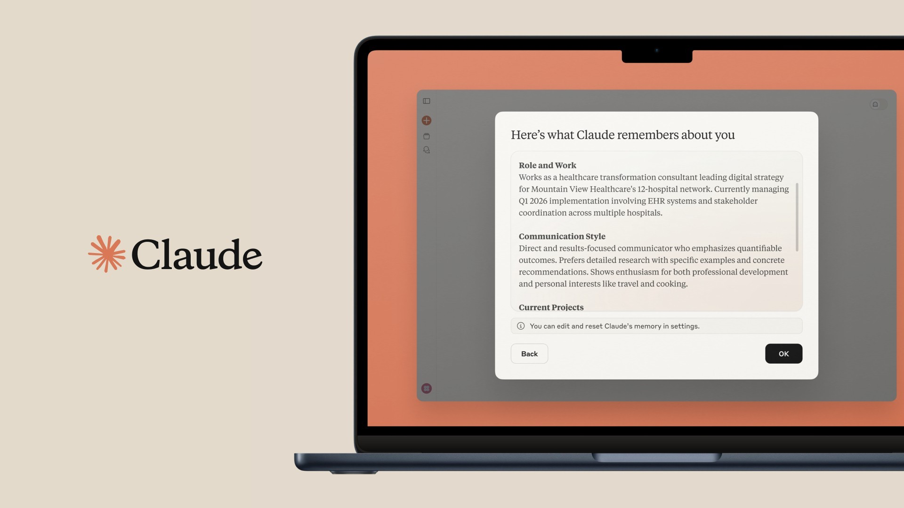](images/07-cross-session-memory.png) |  |
| Custom instructions/persona | User-defined behavioral guidelines | Global two-field (ChatGPT), per-project (Claude), per-file (.cursorrules), per-workspace (Notion) | V3 / D | ChatGPT (most accessible) | [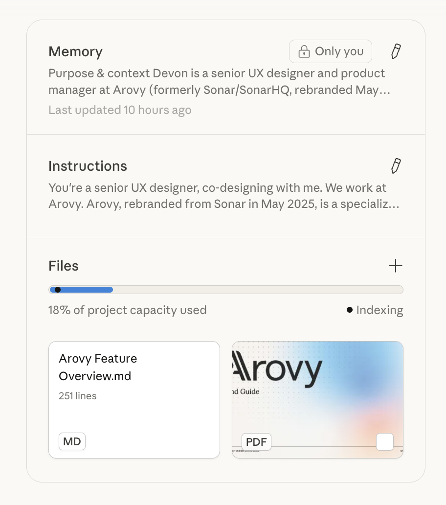](images/07-custom-instructions-persona.png) |  |
| Context window indicator | Shows remaining capacity or warns of limits | No product shows a live token meter; warnings are reactive | V2 / D | None do this well | [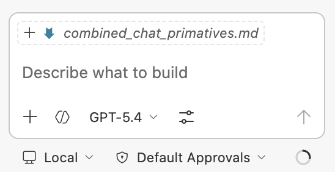](images/07-context-window-indicator.png) [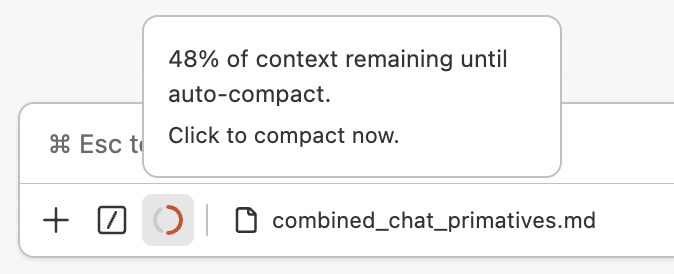](images/07-context-window-indicator-2.png) |  |
| Context loading/"reading" states | Status messages when ingesting documents | "Reading your files..." progress per file, checklist of sources | V2 / D | Claude, Gemini | [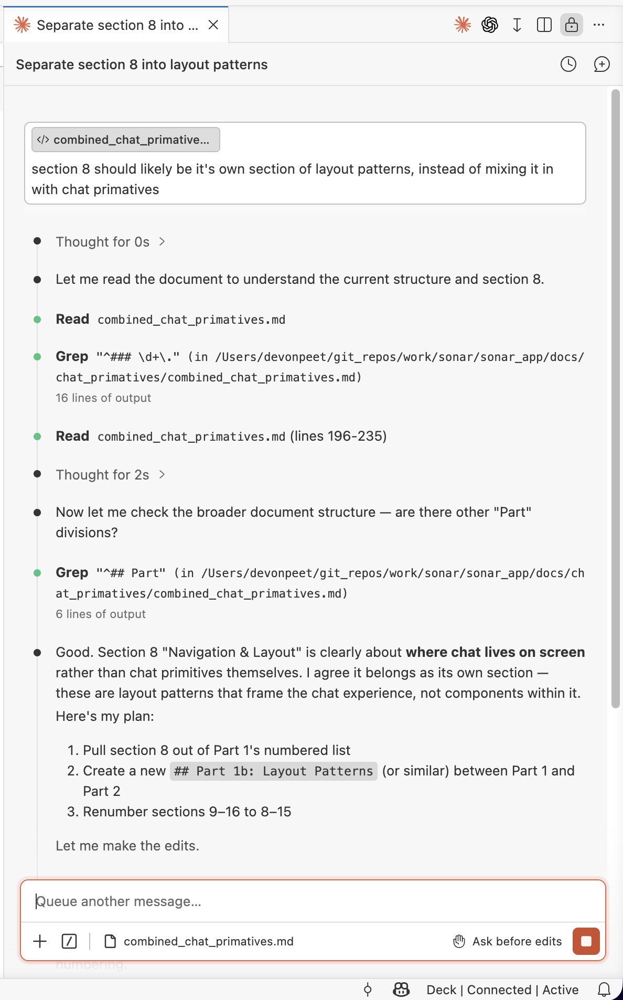](images/07-context-loading-reading-states.png) |  |
| Ecosystem/app integration | AI accesses data from connected tools | ChatGPT Connectors (17+ apps), Claude MCP, Gemini native Workspace, Slack Enterprise search | S / D |  | [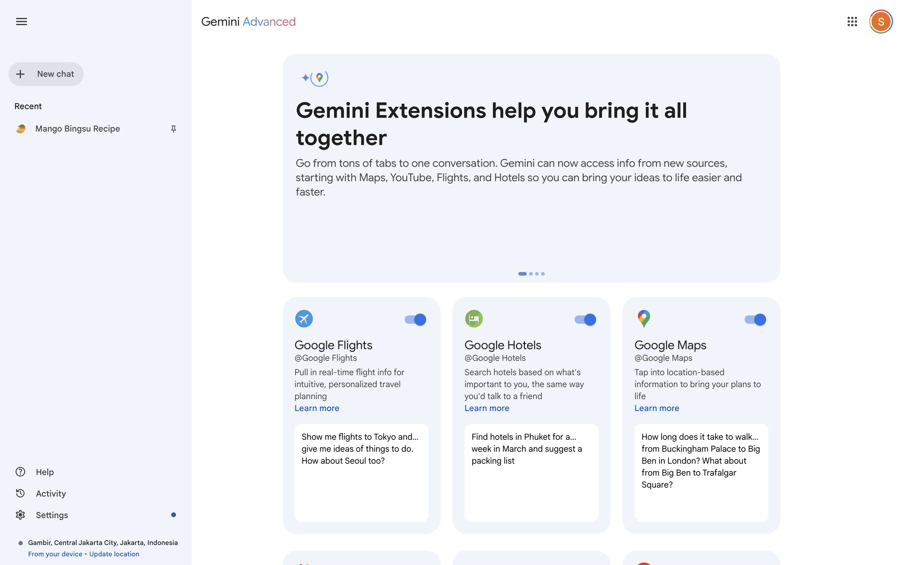](images/07-ecosystem-app-integration.png) |  |

---

### 8. Conversation Management

| Component | Description | Key Variants | Pri / Class | Best Example | Visual | Notes |
| --- | --- | --- | --- | --- | --- | --- |
| Clear/reset conversation | Start over without leaving the UI | "Reset thread," "Start fresh," new section divider | MVP / TS |  | <!-- pending: 09-clear-reset-conversation.png --> |  |
| Export conversation | Save/share transcript in other formats | Markdown, PDF, JSON, knowledge bases | V2 / D | Enterprise tools | <!-- pending: 09-export-conversation.png --> |  |
| Bookmark specific messages | Star important turns inside a thread | Per-message star, "highlights" list | V3 / D | Slack (channel bookmarks) | <!-- pending: 09-bookmark-specific-messages.png --> |  |
| Search within conversation | Find specific content inside one long thread | In-thread search box, next/prev navigation | V2 / D | Slack AI | <!-- pending: 09-search-within-conversation.png --> |  |
| Jump to message | Navigate directly to a referenced message | Linked timestamps, "jump to source" from summary | MVP / D | Slack AI | <!-- pending: 09-jump-to-message.png --> | This could be helpful to navigate the app as well |
| Collapse older messages | Fold earlier parts of a long chat | "Collapse," "Jump to latest," collapsed summary | S / D | Research-style UIs | <!-- pending: 09-collapse-older-messages.png --> |  |
| Timestamps | Show when messages were sent/seen | Relative vs absolute time, unread indicators | S / D |  | <!-- pending: 09-timestamps.png --> |  |
| Message grouping | Visual grouping of consecutive same-role messages | Merged bubbles, shared timestamp | S / D | — | <!-- pending: 09-message-grouping.png --> |  |

---

### 9. Multi-Modal & Rich Interactions

| Component | Description | Key Variants | Pri / Class | Best Example | Visual | Notes |
| --- | --- | --- | --- | --- | --- | --- |
| Image analysis & vision | AI reasons over images — identifies content, extracts data, answers visual questions | Single image Q&A, multi-image comparison, live camera feed, diagram/chart interpretation | v2 / TS |  | <!-- pending: 10-image-analysis-vision.png --> | Requires model with image analysis capability |
| Interactive live preview | Rendered, interactive output directly in interface | v0 live app preview, Claude Artifact React rendering, Canvas code execution | S / D | v0 (full interactive web app preview) | [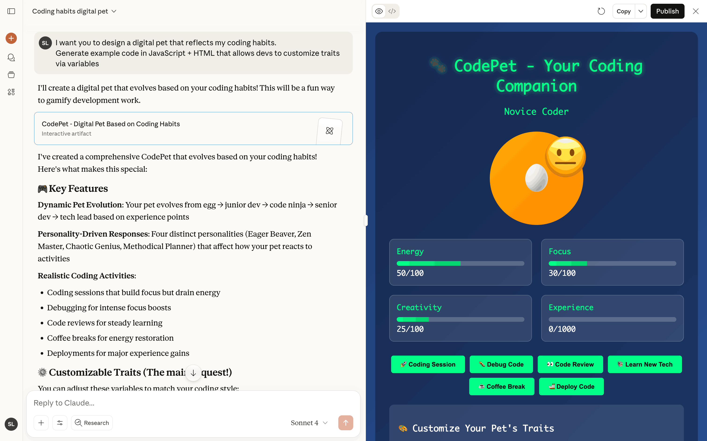](images/10-interactive-live-preview.png) | Another example of "ephemeral UI" that could be useful |
| Image generation | AI creates images from text descriptions | DALL-E (ChatGPT), Imagen 4 (Gemini), inline in conversation | S / D | Gemini (Imagen 4 + Veo 3 video) | [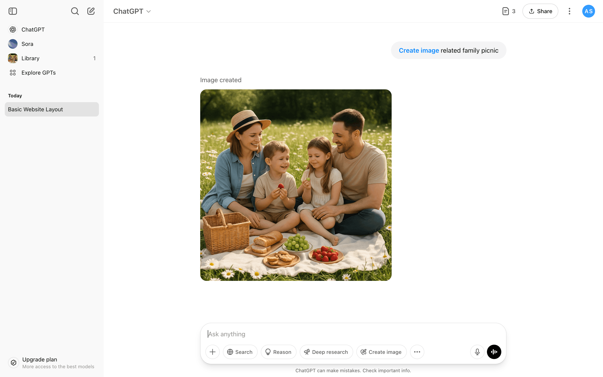](images/10-image-generation.png) |  |
| Code execution sandbox | Run code and display results within chat | ChatGPT Code Interpreter (Python), Gemini Python execution | S / D | [Claude's Visual and Interactive content](https://support.claude.com/en/articles/13641943-visual-and-interactive-content) | <!-- pending: 10-code-execution-sandbox.png --> | skip for now, but if we end up going deeper into salesforce it could be useful |
| Interactive data cards | Structured, actionable data widgets in responses | Perplexity Knowledge Cards (weather, stocks), Salesforce record cards | - / D | Perplexity, Salesforce | [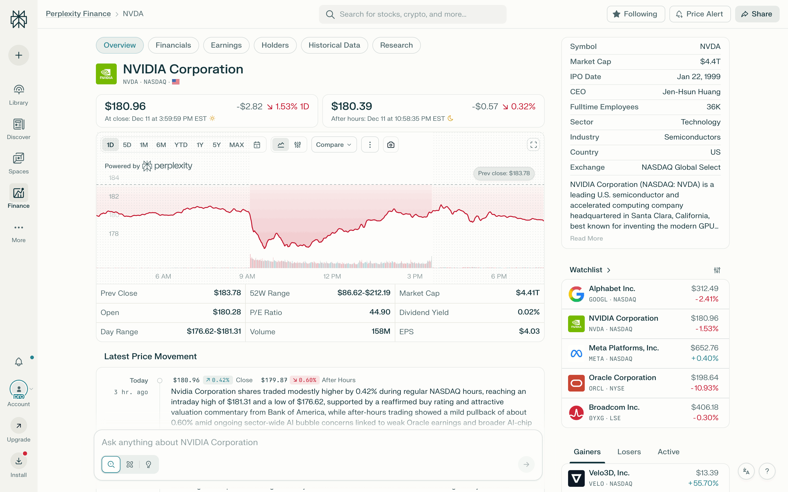](images/10-interactive-data-cards.png) | C only. `[AROVY DECISION]` Salesforce object cards, connected app risk cards, permission summary cards — this is core Arovy territory. |
| Action buttons in responses | Clickable buttons that trigger next steps | Salesforce suggested follow-up actions, Copilot "Insert at cursor" | - / D | Salesforce Einstein | <!-- pending: 10-action-buttons-in-responses.png --> | B and C. `[AROVY DECISION]` "Revoke this app's access," "Generate documentation," "Add to audit queue" — action buttons in AI responses. |
| In-chat forms (GenUI) | AI generates structured form inputs inline | Date pickers, dropdowns, multi-field forms, checklists | - / D | Salesforce CRM copilots | <!-- pending: 10-in-chat-forms-genui.png --> | A emphasizes this as the GenUI paradigm. `[AROVY DECISION]` AI generating a connected app review form inline instead of a back-and-forth conversation. |
| Audio output | AI-generated audio from content | Gemini Audio Overview (podcast-style), ChatGPT voice responses | - / D | Gemini (Audio Overview) | <!-- pending: 10-audio-output.png --> | C only |
| Interactive charts/visualizations | Rich inline visualizations user can inspect | Charts with hover, sortable tables, stat cards | - / D | ChatGPT visual responses |  | A, B, C. `[AROVY DECISION]` Inline dependency graphs, risk distribution charts, permission coverage visualizations. |
| Embedded maps/locations | Map widgets inside chat for geo queries | Static map images, interactive map cards | - / D | ChatGPT | <!-- pending: 10-embedded-maps-locations.png --> | A and B. Likely irrelevant for Arovy. |
| Embedded diagrams | Visual diagrams generated within responses | Mermaid diagrams, SVG graphics | - / D | Claude Artifacts | <!-- pending: 10-embedded-diagrams.png --> | C only. `[AROVY DECISION]` Dependency diagrams, data flow visualizations — relevant for Arovy. |
| File download links | Links to generated or transformed files | Download buttons, "open in..." integration | - / TS |  | <!-- pending: 10-file-download-links.png --> | B only |

---

### 10. Tool Use & Actions

| Component | Description | Key Variants | Pri / Class | Best Example | Visual | Notes |
|-----------|-------------|--------------|------|--------------|--------|-------|
| "Using tool..." indicator | Explicit notice that a tool is running | Banner, inline status row, animated icon + action name | - / TS |  | <!-- pending: 11-using-tool-indicator.png --> |  |
| Tool result display | Structured display of tool output | Collapsible card, separate section, attachment | - / TS | GitHub Copilot ("Used references" with file/line citations) | <!-- pending: 11-tool-result-display.png --> | . A: raw JSON hidden behind "View Details" toggle. |
| Confirmation before action (HITL) | Human-in-the-loop approval for consequential actions | "Are you sure?" modal, preview of changes, Approve/Deny/Modify buttons | - / D | Zendesk (auto-assist: agent reviews and approves) | <!-- pending: 11-confirmation-before-action-hitl.png --> | . A calls this "The Approval Card" — AI cannot proceed until user interacts. `[AROVY DECISION]` For Arovy, any action that modifies Salesforce metadata (revoking access, changing permissions) MUST have HITL. This is TS for Arovy. |
| Undo/rollback | Let users revert AI-initiated actions | "Undo last action," version history, diff rollback | - / D | ChatGPT Canvas (clock icon for version history) | <!-- pending: 11-undo-rollback.png --> | B and C |
| Checkpoints | Snapshot state before AI modifications | Cursor automatic checkpoints before every edit, git-independent snapshots, one-click restore | - / D | Cursor | <!-- pending: 11-checkpoints.png --> | C only. `[AROVY DECISION]` Before any AI-initiated metadata change, a snapshot/checkpoint for rollback. |
| Action history/audit trail | Record of all tools the AI invoked and results | Timeline sidebar, logs under message, downloadable log | - / D | Slack Agentforce | <!-- pending: 11-action-history-audit-trail.png --> | A and B. `[AROVY DECISION]` For enterprise compliance, audit trail of AI actions is closer to TS. |
| Multi-step workflow progress | Visual choreography of multi-step AI workflows | Stepper (plan→search→draft→revise), checkmarks, stage chips | - / D | Gemini Deep Research (live multi-stage pipeline) |  | . `[AROVY DECISION]` "Scanning org → Identifying risks → Generating recommendations → Drafting documentation." |
| Parallel tool execution indicators | Show multiple concurrent tasks | Task list, "n of m complete," separate spinners | - / D | Cursor 2.0 (up to 8 parallel agents) | <!-- pending: 11-parallel-tool-execution-indicators.png --> | B and C |
| Background agent notifications | AI completes long-running tasks and notifies user | Work on separate branches, push notifications on completion | - / D | Cursor (Background Agents create PRs) | [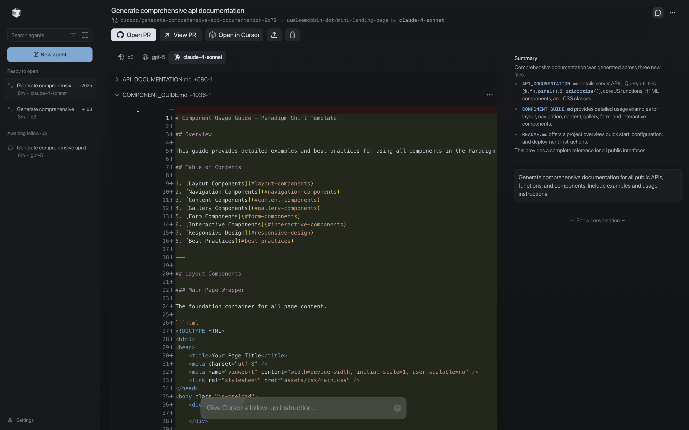](images/11-background-agent-notifications.png) | C only. Cutting-edge. |

---

### 11. Collaboration & Sharing

| Component | Description | Key Variants | Pri / Class | Best Example | Visual | Notes |
|-----------|-------------|--------------|------|--------------|--------|-------|
| Shareable conversation link | Public or team-scoped URL to a conversation | Public link, privacy toggle, read-only for recipients | - / TS |  | [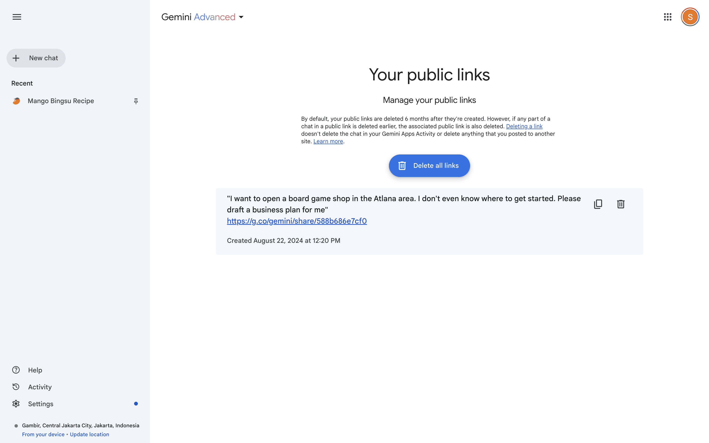](images/12-shareable-conversation-link.png) |  |
| @-mention teammates | Pull colleagues into an AI-assisted thread | @username in thread, AI summaries for mentioned users | - / D | Slack AI | <!-- pending: 12-mention-teammates.png --> | B only |
| Team/shared workspaces | Collaborative AI environments with role-based permissions | ChatGPT Team, Claude Team Projects, Perplexity Spaces | - / D | Claude (Private/Can use/Can edit permissions) | [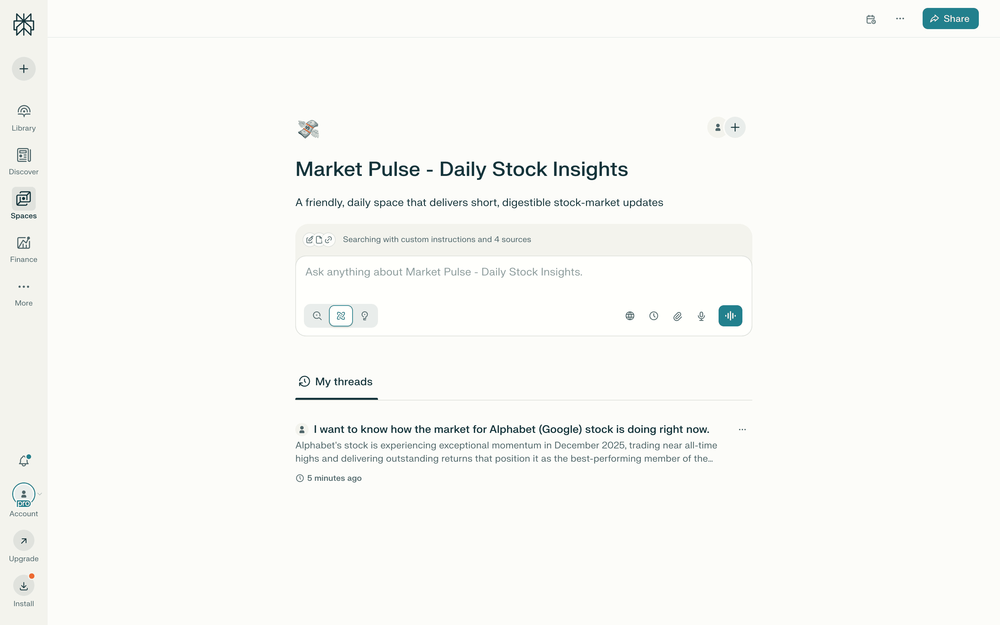](images/12-team-shared-workspaces.png) | B and C |
| Comment on AI responses | Human comments layered on top of AI output | Inline comments, side annotations, suggested edits | - / D | Canvas-style UIs | <!-- pending: 12-comment-on-ai-responses.png --> | A and B. A describes "Google Docs style commenting on AI chat." |
| Fork someone else's conversation | Duplicate another user's chat and continue separately | "Use this chat," clone template, copy link as starting point | - / D | ChatGPT (shared templates) | <!-- pending: 12-fork-someone-elses-conversation.png --> | A and B |
| Shared prompt library | Team-wide reusable prompts | Copilot prompt files in repo, .cursorrules, Salesforce Prompt Builder | - / D | GitHub Copilot (repo-level shared prompt files) | <!-- pending: 12-shared-prompt-library.png --> | C only |

---

### 12. Personalization & Settings

| Component | Description | Key Variants | Pri / Class | Best Example | Visual | Notes |
|-----------|-------------|--------------|------|--------------|--------|-------|
| Dark/light theme | Visual theme toggle | System-following, manual toggle | - / TS |  | <!-- pending: 13-dark-light-theme.png --> |  |
| Keyboard shortcuts | Power-user accelerators | ⌘⇧O new chat, ⌘⇧S sidebar, ⌘/ shortcut list | - / TS | Cursor (most keyboard-driven) | <!-- pending: 13-keyboard-shortcuts.png --> |  |
| Agent/persona customization | Visual and behavioral personalization | Customize name, accessory, communication style (Notion), voice personas (Gemini) | - / D | Notion AI | <!-- pending: 13-agent-persona-customization.png --> | C only. `[AROVY DECISION]` An "Arovy AI" persona with consistent branding vs generic chatbot feel. |
| Tone/verbosity controls | High-level style and length settings | "Brief/Normal/Detailed," "Formal/Friendly," sliders | - / D | — | <!-- pending: 13-tone-verbosity-controls.png --> | B only |
| Saved prompts/libraries | Manage reusable prompts/snippets | Personal vs team libraries, tags, search | - / D | Enterprise ChatGPT | <!-- pending: 13-saved-prompts-libraries.png --> | B only |
| Language/locale preferences | Configure language and region | UI language, answer language, locale assumptions | - / TS |  | <!-- pending: 13-language-locale-preferences.png --> | B only |
| Model/capability selection | Choose which model or skill set | GPT-5 vs smaller, "Auto/Fast/Thinking," domain-specific | - / TS (for pro users) |  | <!-- pending: 13-model-capability-selection.png --> | B and C |
| Custom rules/instruction files | Project-level AI behavior configuration | .cursorrules, .github/copilot-instructions.md, AGENTS.md | - / D | Cursor | <!-- pending: 13-custom-rules-instruction-files.png --> | C only |
| Memory management | View and edit what AI "knows" about user | Memory list settings page, delete/edit specific memories | - / D | ChatGPT, Claude | <!-- pending: 13-memory-management.png --> | A only |

---

### 13. Trust & Safety

| Component | Description | Key Variants | Pri / Class | Best Example | Visual | Notes |
|-----------|-------------|--------------|------|--------------|--------|-------|
| Source attribution/citations | Verifiable references for AI claims | Inline numbered citations with source cards and hover previews, article links, record links | - / D | **Perplexity (gold standard)** |  | . `[AROVY DECISION]` Citing Salesforce metadata records, audit entries, or specific API logs as sources. Near-TS for enterprise. |
| Content warnings | Notices for sensitive/unsafe content | Inline warnings, blurred content, interstitials | - / TS |  | <!-- pending: 14-content-warnings.png --> | B and C |
| Confidence/quality indicators | Indicate uncertainty or low confidence | "May be inaccurate" labels, confidence badges, warning icons, yellow highlighting | - / D | — | <!-- pending: 14-confidence-quality-indicators.png --> | A: "Uncertainty highlighting" with low log-probability text in yellow. C: Linear hover-to-explain with reasoning + alternatives. `[AROVY DECISION]` For security recommendations, confidence indicators build trust. |
| "I'm not sure" hedging | Explicit acknowledgment of uncertainty | Softening language, suggestions to verify sources | - / TS (good practice) | — | <!-- pending: 14-i-m-not-sure-hedging.png --> | B and C |
| Data privacy notices | Explain what is logged/used for training | Banners, settings tooltips, onboarding copy | - / TS |  | [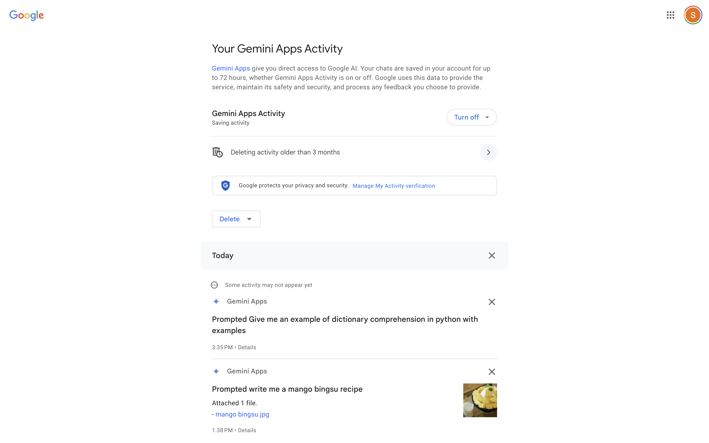](images/14-data-privacy-notices.png) | B and C. `[AROVY DECISION]` Enterprise customers WILL ask. This is TS. |
| Audit logging | Track who saw/triggered what | Exportable logs, admin consoles, per-user audit | - / D | Slack Agentforce, Copilot | [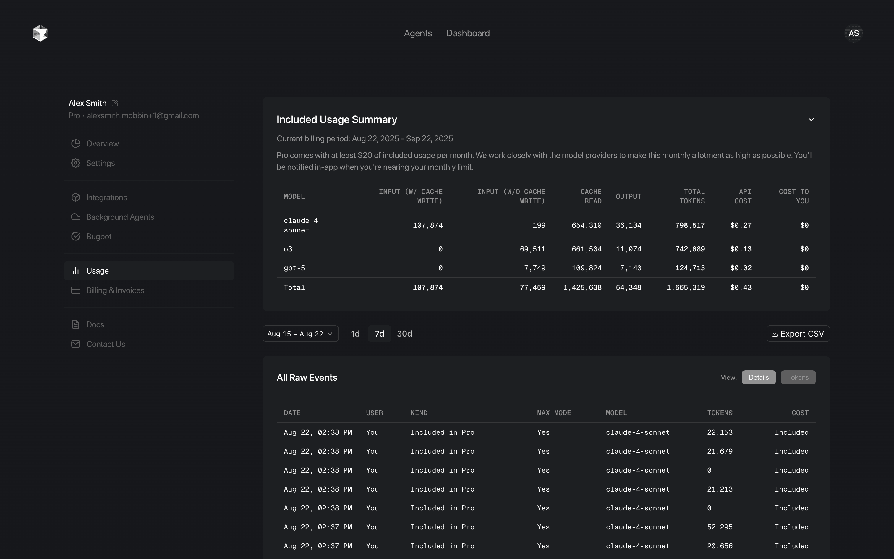](images/14-audit-logging.png) | B and C. `[AROVY DECISION]` For enterprise compliance, closer to TS. |
| Role-based access controls | Restrict which AI features are exposed to whom | Role-based feature flags, per-team quotas, org policies | - / TS (enterprise) | Salesforce Agentforce, Copilot | <!-- pending: 14-role-based-access-controls.png --> | B and C. `[AROVY DECISION]` TS for Arovy — different Salesforce roles need different AI capabilities. |
| Human handoff/escalation | Transition from AI to human agent | Visual transition with agent avatar swap, configurable escalation rules, context preservation | - / TS (for support) | Intercom Fin | <!-- pending: 14-human-handoff-escalation.png --> | C only |
| Einstein Trust Layer | Enterprise trust architecture | Zero-data retention, data masking, audit trails, permission-respecting, object-grounded responses | - / D | Salesforce Einstein | <!-- pending: 14-einstein-trust-layer.png --> | C only. `[AROVY DECISION]` Arovy's trust architecture for AI should reference this model. |
| Thinking redaction | Safety system intervention in reasoning display | Partially redacted thinking blocks with explanatory message | - / D | Claude | <!-- pending: 14-thinking-redaction.png --> | C only |
| Explainable suggestions | Reasoning visible for AI recommendations | Hover → see reasoning + alternatives (Linear) | - / D | Linear | <!-- pending: 14-explainable-suggestions.png --> | C only. `[AROVY DECISION]` "Why did AI flag this app as high risk?" — hover-to-explain is high-value. |
| Content quality scoring | Automated quality assessment of AI interactions | AI-powered CSAT coverage, 100% conversation review | - / D | Intercom CX Score | <!-- pending: 14-content-quality-scoring.png --> | C only |

---

### 14. Onboarding & Discovery

| Component | Description | Key Variants | Pri / Class | Best Example | Visual | Notes |
|-----------|-------------|--------------|------|--------------|--------|-------|
| Welcome/empty state | Content shown before first message | Suggestion cards, capability overview, brand personality | - / TS |  |  | . A emphasizes context-aware empty states (e.g., based on current page). |
| Mascot/avatar/persona | Visual "face" of the assistant | Static avatar, animated character, brand-aligned icon | - / D | Various | <!-- pending: 15-mascot-avatar-persona.png --> | B only |
| Capability discovery | Progressive revelation of AI features | Tool menu exposing modes, "+" button revealing modes, sparkle icon in editor | - / TS | Gemini (mode buttons visible in prompt bar) |  | C only |
| Guided first conversation | Structured onboarding via initial interaction | Notion agent personalization flow, Copilot quickstart tutorial | - / D | Notion AI (first-run personalization) | <!-- pending: 15-guided-first-conversation.png --> | A: AI leads user through "Sample Conversation" in sandboxed environment. C: agrees. |
| Feature discovery tooltips | In-product education for new features | Tooltips, coach marks, "What's new" modals | - / TS |  | <!-- pending: 15-feature-discovery-tooltips.png --> | B and C |
| Capability list / "What can I do?" | Overview of supported tasks | Categorized lists, cards, mini-gallery | - / TS | ChatGPT |  | B only |
| Sample conversation gallery | Pre-made example chats | Browseable gallery, "Try this" buttons | - / D | Various | [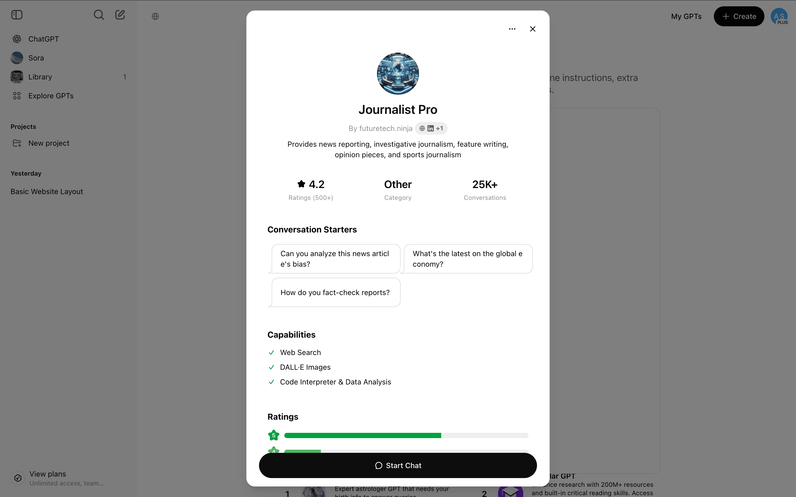](images/15-sample-conversation-gallery.png) | A and B |
| Feature preview toggles | Opt-in to experimental features | Claude "Feature Preview" in settings, Perplexity Labs | - / D | Claude | <!-- pending: 15-feature-preview-toggles.png --> | C only |
| Year-in-review / usage summaries | Reflective summary of AI usage | "Wrapped" experience, archetypes, stats | - / D | ChatGPT 2025 | [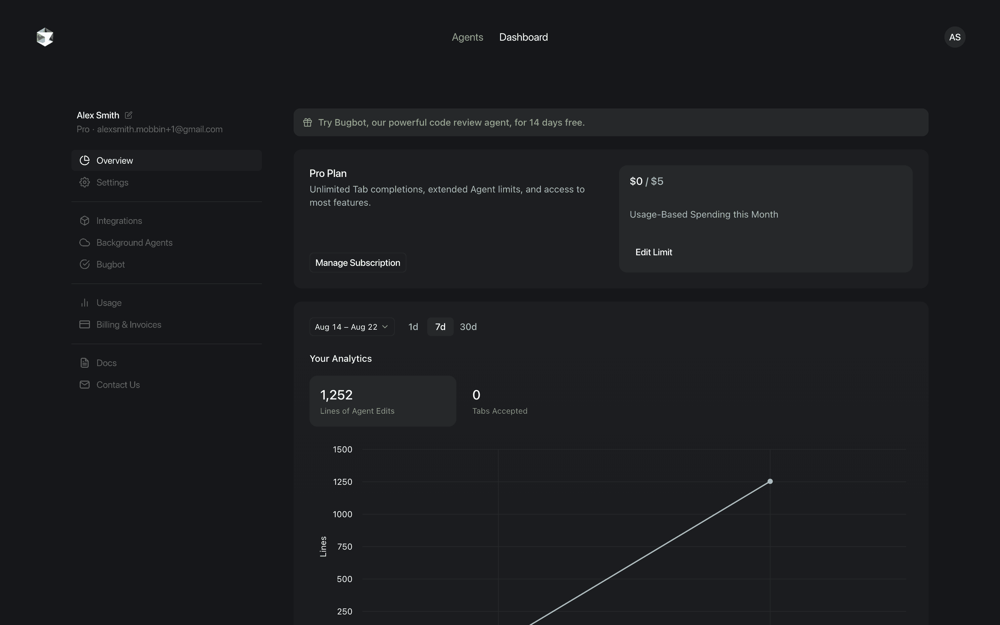](images/15-year-in-review-usage-summaries.png) | B only. Novel retention/engagement pattern. |

---

### 15. Enterprise & Support Patterns

*This category is sourced primarily from Report C and covers patterns specific to enterprise, CRM, and support contexts.*

| Component | Description | Key Variants | Pri / Class | Best Example | Visual | Notes |
|-----------|-------------|--------------|------|--------------|--------|-------|
| Intelligent triage | Automatic classification and routing of incoming items | Assignee/project/label/duplicate suggestions (Linear), intent/sentiment/language detection (Zendesk), Fin Attributes (Intercom) | - / D | Linear (proactive triage with one-click accept, hover-to-explain) | <!-- pending: 16-intelligent-triage.png --> | `[AROVY DECISION]` For Arovy's connected app security alerts — auto-triage by risk level, app category, team. |
| CRM data grounding | Responses anchored to structured business data | Record lists, summaries, cross-object queries, grounded in Data Cloud | - / D | Salesforce Einstein | <!-- pending: 16-crm-data-grounding.png --> | `[AROVY DECISION]` Arovy's responses must be grounded in actual Salesforce metadata, not hallucinated. This is TS for Arovy. |
| Agent copilot panel | AI assistance sidebar for human agents | Intelligence panel (summary, sentiment, intent, suggested macros), source citations for agents | - / D | Zendesk (richest agent-assist panel) | <!-- pending: 16-agent-copilot-panel.png --> |  |
| Procedures/workflows | Natural-language definitions of multi-step business processes | Zendesk Procedures, Intercom Fin Procedures with code blocks, Salesforce Topics + Actions | - / D | Intercom Fin 3 (document-style procedure editor) | <!-- pending: 16-procedures-workflows.png --> | `[AROVY DECISION]` "When a new connected app is detected, classify risk, notify security team, generate documentation." |
| Automated resolution | End-to-end autonomous issue resolution without human intervention | Zendesk AR, Intercom Fin resolution, Salesforce case management | - / D | Zendesk (30% automation from day one) | <!-- pending: 16-automated-resolution.png --> |  |
| Governor patterns | Provisional AI content at reduced opacity until user approves | Content rendered at lower opacity/confidence styling, transitions to full when user accepts | D (nascent) | Emerging | <!-- pending: 16-governor-patterns.png --> | C calls this Tier 5/experimental. `[AROVY DECISION]` AI-drafted documentation shown as "provisional" with a visual treatment until admin approves. Aligns with Arovy's existing AI badge pattern. |

---

## Part 2: Atomic Design Hierarchy

Applying Brad Frost's atomic design methodology to conversational UI. All three reports use this framework; the synthesis below combines the most detailed elements from each.

### Atoms — Indivisible Elements

The smallest UI units that cannot be broken down further without losing functional meaning.

**Interactive atoms:**

- Send button (icon button)
- Stop button (square icon, replaces send during generation)
- Copy icon (with "Copied!" success state)
- Thumbs up/down icons (outline → filled states)
- Microphone button
- Attachment/paperclip button

**Display atoms:**

- Avatar image (user, AI, tool)
- Timestamp text (relative: "2m ago" / absolute: "10:04 AM")
- Badge/label ("AI", "Beta", "Thinking...", "TS", unread count)
- Citation badge (clickable reference number: [1], [2])
- Spinner animation
- Status dot (online/thinking/offline)
- Typing/thinking indicator (blinking cursor, bouncing dots, state-colored caret)
- Divider line
- Tooltip
- Confidence bar segment
- Audio waveform bars

**Information atoms:**

- Token counter (text: "4k/128k" or mini progress bar)
- Model logo/icon (SVG brand mark)
- Language label on code blocks

**Design tokens:**

- Bubble border-radius
- Message spacing
- Brand colors
- Typography scale

### Molecules — Functional Combinations

Molecules combine atoms into purposeful interaction units.

**Message bubble molecule:**
Avatar + name label + text content + timestamp + AI-generated badge → displays a single conversation turn.

**Input bar molecule:**
Text area + attachment button + voice button + send button + (optional: model selector, mode toggle) → the primary command center for user intent.

**Feedback strip molecule:**
Thumbs up + thumbs down + copy + regenerate + share → appears on every AI response.

**Code block molecule:**
Syntax-highlighted code + language label + copy button + (optional: Apply, Insert at Cursor, Run) → formatted executable content.

**Citation card molecule:**
Favicon + domain/source name + title + snippet text → metadata for a single source reference.

**Tool status molecule:**
Spinner + action text ("Searching...") + tool icon + (optional: collapsible result panel) → communicates tool execution.

**Suggestion row molecule:**
Container + scroll/carousel controls + 2-4 suggestion chip atoms → offers follow-up actions.

**Thinking block molecule:**
Chevron toggle + label ("Thinking...") + timer atom + pulsing/shimmer container → encapsulates chain-of-thought.

**Context chip molecule:**
File/object icon + name + removable "x" button → represents a single context item.

**Model selector molecule:**
Dropdown + model name + capability badge + (optional: "Auto" mode indicator) → model/mode switching.

**Triage suggestion card molecule** (enterprise):
Suggested assignee/label/category + accept/dismiss buttons + hover-to-explain popover → proactive AI recommendation.

### Organisms — Complex Functional Sections

Organisms compose molecules into complete interface sections.

**The chat message list:**
Scrollable container of message bubble molecules with typing indicator, date separators, and thinking blocks → the chronological conversation record.

**The chat input area:**
Input bar molecule + quick reply/suggestion row + (when empty: starter prompt cards) + file preview strip → the complete input surface.

**The chat header:**
Bot identity + model selector + settings menu + minimize/close controls → session identification and control.

**The conversation sidebar:**
Search bar + new chat button + conversation list items + folder/project navigation + user profile → global navigation and session management.

**The response block:**
AI message bubble + feedback strip + follow-up suggestions + citation cards + (optional: tool execution details) → a complete AI response unit.

**The artifact/canvas panel:**
Toolbar (version history, copy, download, share) + editor surface + preview renderer + expand/collapse → persistent workspace for iterating on content.

**The tool execution panel:**
Tool status molecules + progress stepper + results preview + approve/reject buttons → visualizes autonomous agent actions.

**The agent status dashboard:**
Tool use status pills + action history log + approval cards → monitors agentic workflow state.

### Templates — Page-Level Layout Patterns

Templates describe *where and how* chat lives on screen — the structural containers that frame conversational UI. These are not chat primitives but the page-level compositions that house them.

*(Synthesized from Report C's template taxonomy and the detailed layout catalog from all three reports.)*

#### Dominant Templates

Five dominant templates emerge across the landscape:

1. **Standard chat template:** Header + message list + input area. The ChatGPT/Claude/Gemini default.

2. **Chat + sidebar template:** Adds conversation history panel to the left of the standard chat.

3. **Chat + artifact template:** Splits screen between chat and editable output surface — the signature pattern of 2024-2025.

4. **Embedded copilot template:** Slide-out drawer alongside an existing application. Salesforce Einstein, Copilot in VS Code, Notion Agent sidebar. `[AROVY DECISION]` This is likely Arovy's primary template.

5. **Ambient intelligence template:** AI woven into existing UI surfaces without a dedicated chat. Linear's triage cards, Slack's search answers and channel summaries. `[AROVY DECISION]` This is the most promising paradigm for Arovy — proactive AI suggestions on connected app pages, permission sets, and dashboards without requiring users to "open a chat."

#### Layout Pattern Catalog

| Component | Description | Key Variants | Pri / Class | Best Example | Visual | Notes |
| --- | --- | --- | --- | --- | --- | --- |
| Full-page chat view | Conversation as the primary screen | Chat is the entire page with optional sidebar | - / TS |  |  |  |
| Collapsible sidebar | Toggleable panel for chat history and navigation | Left sidebar with keyboard shortcut toggle (⌘⇧S) | - / TS |  |  |  |
| Slide-out/drawer panel | Chat opens as a side panel within another application | Salesforce Einstein sidebar, Copilot in VS Code, Slack agent split view | - / TS (for embedded AI) | Salesforce Einstein | <!-- pending: 08-slide-out-drawer-panel.png --> |  |
| Split-pane (chat + artifact) | Side-by-side chat and editable output surface | Claude Artifacts, ChatGPT Canvas, v0 three-pane (chat + preview + code) | - / D | v0 (three-pane), Claude Artifacts |  | on importance. `[AROVY DECISION]` Chat + live impact graph, or chat + documentation draft. High-value pattern. |
| Inline/embedded chat | Chat prompt appears directly within content context | Cursor Cmd+K (inline in editor), Copilot inline chat, Notion space-bar trigger | - / D | Cursor | <!-- pending: 08-inline-embedded-chat.png --> | B and C. `[AROVY DECISION]` An inline "Ask AI" prompt directly on a Salesforce object page or permission matrix. |
| Floating widget | Minimizable chat bubble on external sites | Intercom Messenger, Zendesk Web Widget — bottom-right expandable | - / TS (for support) | Intercom | <!-- pending: 08-floating-widget.png --> | B and C |
| Mission control / grid view | Monitor multiple parallel AI tasks simultaneously | Cursor 2.0 macOS Exposé-style grid of agent tasks | - / D | Cursor 2.0 | <!-- pending: 08-mission-control-grid-view.png --> | C only. Cutting-edge. |
| Design mode toggle | Switch from chat to visual direct-manipulation of output | v0: click elements → adjust properties visually | - / D | v0 | <!-- pending: 08-design-mode-toggle.png --> | C only |
| Mobile-responsive layout | Touch-optimized with adapted controls | Larger mic/camera buttons, swipe gestures, Canvas features often desktop-only | - / TS | Gemini (best mobile parity) | <!-- pending: 08-mobile-responsive-layout.png --> |  |
| Multi-panel layout | Chat plus tools, results, and previews as distinct panels | Tabs in channel, stacked panels, collapsible sidebars | - / D | Slack | <!-- pending: 08-multi-panel-layout.png --> | B only |

---

## Part 3: Competitive Maturity Model

This tiered model (from Report C, validated against A and B) maps patterns by competitive maturity. Items move up tiers over time as they become expected.

### Table Stakes — The 20 Non-Negotiables (2025)

Every modern AI interface must have these. Their absence is immediately noticed.

1. Auto-resizing text input with Enter-to-send / Shift+Enter for newlines
2. Token-by-token streaming with auto-scroll
3. Stop generation button (Esc key as universal standard)
4. Markdown rendering (headers, bold, lists, code blocks, tables)
5. Syntax-highlighted code blocks with copy button
6. Visually distinct user/AI message styling
7. Typing/thinking indicator
8. Conversation history sidebar with search
9. New conversation button (keyboard-accessible)
10. Thumbs up/down feedback on every response
11. Regenerate response
12. Copy full response
13. Edit and resubmit previous prompt
14. Empty-state suggestion cards (3-4 starters)
15. Follow-up suggestion chips
16. File & image input (attachment button, drag-and-drop, paste)
17. Model/mode selector
18. Dark/light theme
19. Mobile-responsive layout
20. Tool execution status indicators

**Near-essential for enterprise:** Source attribution/citations, human handoff/escalation, data privacy notices, role-based access controls.

### Tier 1: Power-User Expected (→ table stakes by 2027)

- Artifact/canvas split-pane editing
- Cross-session memory with user controls
- Web search with inline citations
- Custom instructions/system prompts
- Conversation sharing links
- Keyboard shortcuts for all major actions

### Tier 2: Competitive Advantages Today

- Extended thinking/reasoning display
- Deep Research with multi-stage progress
- @-mention context references
- Inline editing within content
- Code apply/accept/reject workflow with diffs
- Conversation branching
- Project-scoped workspaces
- Voice input/output modes

### Tier 3: Cutting-Edge (Category Leaders Only)

- Background/parallel agents
- Live interactive preview panes
- Checkpoint/rollback systems
- Mission control for multi-agent monitoring
- MCP integrations
- Ambient proactive intelligence (Linear-style)
- Computer use/screen control
- Generative UI
- Design mode toggle

### Tier 4: Enterprise-Specific (Critical for Arovy)

- Trust layer architecture (data masking, zero retention, audit trails)
- Intelligent triage with explainability
- CRM/metadata data grounding
- Agent copilot panels for human agents
- Natural-language procedure builders
- Automated resolution metrics
- Role-based AI access controls
- Compliance logging
- Human-in-the-loop approval flows for consequential actions

### Tier 5: Nascent/Experimental

- Governor patterns (provisional content at reduced opacity)
- Confidence visualization per-claim
- AI-generated workflows from natural language
- Trust calibration (progressive autonomy as trust builds)
- Output format switching (toggle between text, table, chart, JSON)

---

## Part 4: Evolution Timeline

### Pre-2023: The Button-Tree Era
- **Paradigm:** "The Support Bot"
- **Key interaction:** Tree-based navigation with quick-reply buttons
- **State:** Stateless — every session started from zero
- **UI patterns:** Persistent menus, rigid button inputs, keyword-matching, "I don't understand" fallbacks
- **Dominant tech:** Dialogflow, Drift, early Rasa, Intercom decision-tree flows
- **Pattern count:** ~15 patterns

### 2023–2024: The Smart Assistant Era
- **Paradigm:** "The Oracle" — ask a question, get an answer
- **Key interaction:** Streaming text generation, free-form input
- **State:** Session-based context (8k–128k tokens)
- **Signature UX innovation:** Token-by-token streaming ("Ghostwriter effect")
- **Emergent patterns:** Streaming text, markdown rendering, code blocks with syntax highlighting, regenerate buttons, edit-and-resubmit, conversation branching, model selectors, custom instructions, empty-state suggestions, follow-up chips, inline citations (Perplexity/Bing), web browsing status, Code Interpreter (July 2023), multimodal image input (GPT-4V, Oct 2023), shareable links, plugin ecosystems, dark mode as developer default
- **Dominant products:** ChatGPT, early Copilot, Perplexity
- **Pattern count:** ~40 patterns

### 2025–2026: The Agentic Co-Worker Era
- **Paradigm:** "The Orchestrator" — assign a goal, review the work
- **Key interaction:** Artifact collaboration, tool use, delegative UI
- **State:** Deep context (1M+ tokens), project awareness, long-term memory
- **Five cutting-edge pattern families:**
  1. **Artifact/canvas systems** — Claude Artifacts, ChatGPT Canvas pioneered split-pane where chat becomes a control channel, not the output surface
  2. **Extended thinking and reasoning transparency** — Claude's expandable thinking with timers, Gemini's multi-stage Deep Research progress
  3. **Agentic task execution** — Cursor Background Agents (separate branches, open PRs), ChatGPT Agent Mode, Notion Agent (20-minute autonomous sessions editing hundreds of pages)
  4. **Ambient/proactive intelligence** — Linear Triage Intelligence suggests without being asked, Slack AI auto-summarizes, Gemini surfaces contextually in Gmail/Docs/Sheets
  5. **Generative UI and dynamic blocks** — v0 generates and renders entire applications from prompts; AI generating interface components tailored to context
- **Other 2025 innovations:** Persistent memory with user controls, parallel agent execution, MCP as standard for tool integration, computer use (Claude), real-time voice conversation, mission control dashboards, checkpoint/rollback, governor patterns
- **Pattern count:** ~80+ patterns

---

## Part 5: Product Reference Matrix

Which product excels at which capability. Sourced from cross-referencing all three reports.

| Capability | Best-in-Class | Runner-Up | Notes |
|-----------|--------------|-----------|-------|
| **Overall chat UX** | ChatGPT | Claude | ChatGPT is the benchmark; Claude is most aesthetically refined |
| **Artifact/canvas** | Claude (Artifacts with live React, version history, sharing) | v0 (three-pane: chat + preview + code) | ChatGPT Canvas also strong |
| **Citations/sources** | **Perplexity** (gold standard) | Gemini | Inline numbers + hover previews + source cards |
| **Reasoning transparency** | Claude (expandable thinking + elapsed timer) | Gemini Deep Research (multi-stage progress) | ChatGPT's is more summarized |
| **IDE-embedded chat** | Cursor (most keyboard-driven, richest modes) | GitHub Copilot (richest @/# taxonomy) | Different strengths |
| **@-mention context** | GitHub Copilot (@workspace/@terminal + #file/#selection) | Cursor (@filename/@Docs/@Web/@Git) | Copilot has richer taxonomy; Cursor has better UX |
| **Document-aware AI** | Notion AI (workspace-wide + 12 app integrations) | Claude (Projects with uploaded Artifacts) | Notion wins on breadth of integration |
| **Enterprise trust** | Salesforce Einstein (Trust Layer) | Copilot (responsible AI docs) | Zero-retention, masking, permission-respecting |
| **Ambient intelligence** | Linear (proactive triage, hover-to-explain) | Slack AI (auto-summaries, channel-aware) | Linear is the model for "AI without a chat panel" |
| **Support/helpdesk** | Intercom Fin (Messenger, Spaces, escalation) | Zendesk (intelligence panel, procedures) | Intercom for consumer; Zendesk for enterprise |
| **CRM copilot** | Salesforce Einstein (sidebar, data-grounded, actions) | — | The reference for embedded CRM AI |
| **Multi-modal** | Gemini (Imagen 4, Veo 3, Audio Overview, camera, Drive) | ChatGPT (voice + vision + tools) | Gemini has broadest multi-modal range |
| **Mobile experience** | Gemini (best native parity) | ChatGPT (synced conversations) | |
| **Diff/accept-reject workflow** | Cursor (granular per-change with checkpoint rollback) | — | Category-defining for code |
| **Parallel agents** | Cursor 2.0 (up to 8 agents, Mission Control) | — | Cutting-edge |
| **Background agents** | Cursor (isolated VMs, creates PRs) | ChatGPT Tasks (scheduled, push notifications) | |
| **Voice mode** | ChatGPT (Advanced Voice Mode with screen sharing) | Gemini Live (with camera) | |
| **Generative UI** | v0 (Vercel) | — | Only product doing this well at scale |
| **First-run onboarding** | Notion AI (personalize name, style, accessory) | ChatGPT (clean empty state) | |

---

## Part 6: Deep Dive — Linear's Ambient Intelligence Model

Linear represents the most fully realized alternative to the "AI chat panel" paradigm. Rather than adding a chatbot sidebar, Linear embeds AI directly into existing workflow surfaces. This section documents the pattern in detail because it has significant implications for enterprise platforms like Arovy where users are already working in data-rich screens.

### The Design Thesis

Linear's Head of Product, Nan Yu, articulates the **"harness" philosophy**:

> "The chat interface, the code editor, the context window — those are all harnesses. A harness wraps intelligence in workflow, context, and constraints to ensure consistent quality."

The argument: a chatbot relies on the user's expertise to extract value (you have to know what to ask). An ambient system provides structured, proactive intelligence that works for everyone — from the power user to the new hire.

### How Triage Intelligence Works

Linear's core AI feature automatically processes every issue entering the Triage queue. No user action triggers it.

**What it suggests:**

- **Team routing** — which team should own the issue
- **Assignee recommendation** — based on who handled similar issues before
- **Label suggestions** — bug, feature, improvement, etc.
- **Duplicate detection** — flags semantically similar existing issues
- **Project assignment** — which project it belongs to
- **Related issue linking** — surfaces connected work across the backlog

**Technical pipeline (3 stages):**

1. **Semantic search** — Turbopuffer + Cohere embeddings create a semantic graph across all issues
2. **Ranking** — Vector similarity ranks candidates from the full backlog
3. **Agentic LLM reasoning** — Frontier models (GPT-5, Gemini 2.5 Pro) make the final decision using an agentic approach where the model pulls in additional context as needed

Processing takes 1–4 minutes per issue (async, in the background) — acceptable because humans rarely triage faster than that.

### The UX Components

**1. Inline suggestion cards**
Appear directly in the issue detail view within a dedicated module. Use Linear's existing visual language — suggestions don't look like a separate "AI feature," they look like Linear surfacing information. Clear visual distinction between human-set metadata and AI suggestions.

**2. Hover-to-explain (reasoning overlay)**
Hover any suggestion → plain-language reasoning appears as a tooltip:
> "This person was the assignee on previous issues related to performance problems in the mobile app launch flow"

Also shows **alternative suggestions** when applicable. An expandable **thinking panel** can reveal the full trace: what context was pulled in, what decisions were made, how guidance shaped the outcome.

**3. One-click accept/dismiss**
Each suggestion has accept and dismiss controls. For duplicates: accept, dismiss, or follow the reference to the duplicate issue. No typing required. Accessible via `Cmd/Ctrl + K` menu ("Find Suggestions") for issues not currently in Triage status.

**4. Graduated automation (auto-apply)**
Launched September 2025. Teams configure rules per property, per value:
- "Always auto-apply team routing"
- "Auto-apply the 'bug' label specifically, but show me other label suggestions for review"

Three modes per team: **show suggestions** / **auto-apply** / **hide**. Configuration at workspace and team level (sub-teams inherit from parents but can override). Auto-applied properties are **visually marked** so users can still review reasoning or override.

**5. Thinking state indicator**
Timer shows when the model is actively processing during the 1–4 minute analysis window. Users see active work rather than dead silence.

**6. Natural language guidance**
"Additional Guidance" text fields at workspace, parent team, and sub-team levels allow teams to steer AI behavior without engineering work. Example: *"Don't suggest duplicates for issues with 'data pull' in the title."* Most local guidance is weighted most heavily.

### Beyond Triage: Pulse (Proactive Digests)

Launched April 2025. AI-generated daily or weekly digests of project and initiative updates, delivered to the user's Linear inbox automatically. Available as text or **audio digest** for on-the-go consumption. Distills all project updates across the company into a short personalized summary. This extends the ambient philosophy from issue-level to organization-level awareness.

### The Ambient vs Chat Comparison

| Aspect | Linear (Ambient) | Chat Panel |
|--------|-------------------|------------|
| **Initiation** | AI acts on every item automatically | User must ask a question |
| **Output format** | Structured metadata (assignee, label, team) | Freeform text response |
| **Interaction cost** | Hover to understand, one-click to accept | Type prompt, parse response |
| **Context provision** | System has full data context automatically | User provides context manually |
| **Workflow impact** | Zero interruption — lives in existing views | Context switch to open chat |
| **Feedback loop** | Accept/dismiss signals improve suggestions | No implicit learning |
| **Expertise required** | Works for all skill levels | Quality depends on prompt skill |
| **Scalability** | Runs on every item without user effort | One query at a time |

### The Five Design Principles

1. **Structured** — AI outputs are typed metadata, not freeform text
2. **Proactive** — acts without being asked, on every incoming item
3. **Embedded** — suggestions appear inline in existing views, not a separate surface
4. **Transparent** — reasoning is always accessible via hover; thinking trace is visible
5. **Graduated** — users control automation level from "show me" → "just do it"

### Implications for Arovy

The parallel between Linear's issue triage and Arovy's connected app security management is strong. Arovy's existing screens — connected app lists, permission set views, audit dashboards — are data-rich surfaces where users already make triage and prioritization decisions.

**Direct translation opportunities:**

| Linear Pattern | Arovy Equivalent |
|---------------|-----------------|
| Auto-classify issue type (bug/feature) | Auto-classify connected app risk level (critical/high/medium/low) |
| Suggest assignee based on history | Suggest responsible team/admin based on app ownership patterns |
| Duplicate detection across backlog | Detect overlapping permission sets or redundant connected apps |
| Hover-to-explain reasoning | "Why is this app flagged as critical?" with hover tooltip |
| One-click accept/dismiss | One-click "Approve risk level" or "Override to low risk" |
| Auto-apply per property | Auto-apply risk classifications for known app categories |
| Natural language guidance | "Fivetran apps in the analytics team are always pre-approved" |
| Graduated automation | "Auto-flag critical, show me medium, hide low" per team |

**Specific Arovy surfaces that could benefit:**

1. **Connected App List** — inline risk classification suggestions, anomaly flags, "3 apps gained admin access this week" as ambient cards
2. **Permission Set Views** — proactive "this permission set grants access to 47 objects, 12 are sensitive" with hover-to-explain
3. **Audit Dashboard** — auto-surfaced "changes requiring review" with accept/dismiss workflow
4. **Data Dictionary** — AI-suggested documentation with governor pattern (provisional at reduced opacity until approved)
5. **Impact Analysis** — proactive dependency warnings when metadata changes are detected: "This field is referenced by 8 connected apps"

**The key question for Arovy:** Ambient intelligence and chat are not mutually exclusive. The strongest approach may be **ambient as primary** (proactive suggestions on existing screens) with **chat as secondary** (for complex, open-ended queries that don't fit structured suggestions). This mirrors how Linear has Triage Intelligence (ambient) alongside their standard AI features.

**Sources:**

- [How we built Triage Intelligence — Linear](https://linear.app/now/how-we-built-triage-intelligence)
- [Triage Intelligence — Linear Docs](https://linear.app/docs/triage-intelligence)
- [AI workflows for product teams — Linear](https://linear.app/ai)
- [Auto-apply triage suggestions — Linear Changelog](https://linear.app/changelog/2025-09-19-auto-apply-triage-suggestions)
- [Linear's Secret to Building Powerful AI Products — Nan Yu interview](https://stories.logrocket.com/p/linear-secret-building-powerful-ai-products-nan-yu)
- [Introducing Pulse — Linear Changelog](https://linear.app/changelog/2025-04-16-pulse)

---

## Appendix A: Inconsistencies & Open Questions

The following items had meaningful disagreement across reports. Each is flagged for Devon to resolve in Arovy's enterprise context.

### Classification Disagreements

| Pattern | Report B | Report C | Recommended | Arovy Consideration |
|---------|----------|----------|-------------|-------------------|
| Search past conversations | Nice-to-have (+) | Table stakes (TS) | - / TS | With hundreds of Salesforce analysis threads, search is essential |
| Voice input | Nice-to-have (+) | Differentiator (D) | - / D | Low priority for keyboard-heavy Salesforce admin users |
| Model selector | Nice-to-have (+) | Table stakes (TS) | - / TS | May not apply if Arovy uses a single model |
| Edit & resubmit | Nice-to-have (+) | Table stakes (TS) | - / TS | Users expect this universally |
| Drag-and-drop | Nice-to-have (+) | Table stakes (TS) | - / TS | Merged into §2 "File & image input" — desktop users expect it |
| LaTeX rendering | Nice-to-have (+) | Table stakes (TS) | Context-dependent | Likely irrelevant for Arovy |
| Skeleton/shimmer loaders | Differentiator (D) | Differentiator (D) | D (general), potentially TS (enterprise) | For structured outputs like risk assessments, shimmer loading is valuable |
| Autocomplete in input | Differentiator (D) | Differentiator (D) | - / D | Could be valuable for Salesforce object name completion |
| Custom instructions scope | Table stakes (TS) | Differentiator (D) | Global = TS, Per-project = D | Per-Salesforce-org instructions are high-value |

### Conceptual Framing Disagreements

| Topic | Report A | Report C | Resolution |
|-------|----------|----------|------------|
| **Generative UI maturity** | Central thesis — "interfaces build themselves" | Tier 3/experimental, only v0 does this well | C is more accurate about current state. A's framing is forward-looking but overstates 2025 maturity. |
| **Atomic hierarchy depth** | 3 levels (atoms, molecules, organisms) | 4 levels (+ templates) | C's templates level is genuinely useful — included in this doc. |
| **Primary paradigm label** | "Orchestrating intelligence" / "Delegative UI" | "Chat as control channel" / "Agentic co-worker" | Same concept, different metaphors. "Delegative UI" is the most concise label. |
| **Enterprise patterns** | Not covered | Dedicated Section 14, Tier 4 differentiators | Complementary — A simply didn't scope for enterprise. |
| **Trust pattern importance** | Trust via reasoning transparency (thinking blocks) | Trust via citations, HITL approval, rollback, audit trails | Both are right — different facets of trust. Enterprise needs the full stack. |

### Source Quality Notes

- **Report A** (Gemini): Zero citations. Strong conceptual framing but claims are unverifiable. Treat as thought-leadership, not research.
- **Report B** (Perplexity): 30 citations with URLs, mix of product docs, blog posts, YouTube, Reddit. Most empirically grounded.
- **Report C**: No inline citations but clearly product-research-based. Most analytically rigorous; strongest enterprise perspective.

### Unresolved Questions

1. **Context window indicator**: All three reports note no product does this well. Is there an opportunity for Arovy to show "analyzing 47 of 200 connected apps — add more?"
2. **Governor patterns**: Only Report C mentions provisional content at reduced opacity. Is this a real emerging pattern or speculative?
3. **Ambient intelligence vs chat**: Linear's triage model (see Part 6) represents a fundamentally different paradigm. The strongest approach may be ambient as primary + chat as secondary — but this requires deciding which Arovy surfaces get ambient treatment first.
4. **GenUI for enterprise**: Could Arovy generate custom forms/cards inline (e.g., a connected app review form) instead of text-based back-and-forth? How far is this from production-ready?
5. **Checkpoint/rollback for metadata**: Cursor's automatic pre-edit checkpoints translate powerfully to CRM contexts. Should Arovy snapshot metadata state before any AI-initiated change?

---

## Appendix B: Arovy-Relevant Pattern Priorities

Based on the synthesis, these patterns warrant deepest evaluation for Arovy's Salesforce-native, enterprise context.

### Highest Priority (likely TS for Arovy)

1. **Embedded copilot template** — slide-out drawer within existing Arovy screens
2. **HITL approval flows** — any action modifying Salesforce metadata requires explicit approval
3. **CRM/metadata data grounding** — responses anchored to actual Salesforce data, not hallucinated
4. **Source attribution** — citing specific objects, audit records, metadata timestamps
5. **AI-generated badges** — clear "AI-generated" indicators (already in progress)
6. **Page/screen context binding** — "Ask AI about this connected app"
7. **Action buttons in responses** — "Revoke access," "Generate documentation," "Add to audit queue"
8. **Data privacy notices** — enterprise customers will ask
9. **Role-based AI access** — different Salesforce roles need different AI capabilities
10. **Multi-step progress** — "Scanning org → Identifying risks → Generating recommendations"

### High Priority (strong differentiators for Arovy)

11. **Ambient intelligence** (Linear model) — proactive AI suggestions on existing screens
12. **Interactive data cards** — connected app risk cards, permission summary cards
13. **Artifact/canvas panel** — chat + live impact graph or documentation draft
14. **Explainable suggestions** — "Why did AI flag this?" hover-to-explain
15. **Governor patterns** — provisional AI content until admin approves
16. **Per-org project scoping** — custom instructions per Salesforce environment
17. **@-mention Salesforce entities** — @Fivetran, @Admin Profile, @Account object
18. **Checkpoint/rollback** — snapshot before AI-initiated metadata changes
19. **Audit trail** — log of all AI actions for compliance
20. **Inline citations** — Perplexity-style grounding for enterprise trust
